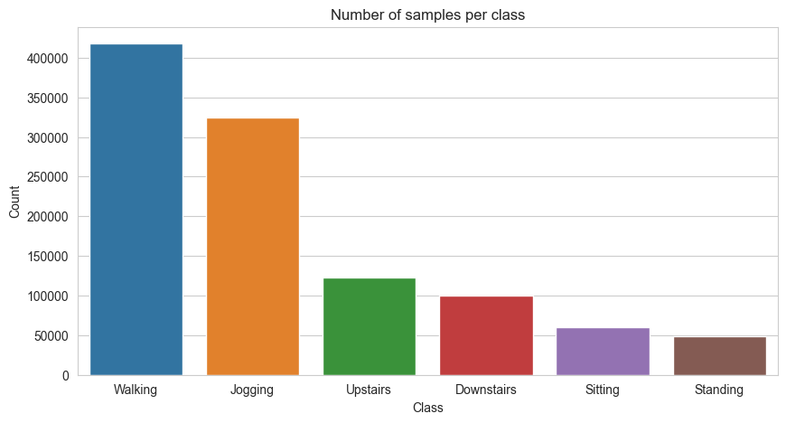

# Real-Time Human Activity Recognition on Microcontrollers: A Quantization-Aware Deep Learning Approach

_Hamza A. Abushahla, Ariel Justine N. Panopio, Layth Al-Khairulla, and Dr. Mohamed Hassan_

This repository contains the full implementation and supplementary materials for our research project, **"Real-Time Human Activity Recognition on Microcontrollers: A Quantization-Aware Deep Learning Approach,"** completed as part of the COE 59413 Tiny Machine Learning course at the American University of Sharjah.

## Dataset 

This work uses the **Wireless Sensor Data Mining (WISDM)**[^1][^2] dataset as our primary public benchmark for human activity recognition (HAR). The dataset consists of **1,098,207 labeled samples** of motion data collected from **36 users** performing **six activities** over specific time periods: walking, jogging, sitting, standing, and ascending and descending stairs. The signals were recorded using smartphone accelerometers, which measure linear acceleration along three axes and can indirectly capture device orientation. Data were sampled at **20 Hz** (1 sample every 50 ms), yielding 20 samples per second.

Each record in the raw dataset contains:

- **User ID**: integer identifier of the subject (1–36).
- **Activity label**: one of `Walking`, `Jogging`, `Upstairs`, `Downstairs`, `Sitting`, or `Standing`.
- **Timestamp**: nanosecond-resolution time at which the sample was recorded.
- **X-axis acceleration**: acceleration along the x dimension (in device coordinates).
- **Y-axis acceleration**: acceleration along the y dimension.
- **Z-axis acceleration**: acceleration along the z dimension.

> **Class distribution:** The WISDM dataset is *class-imbalanced*—some activities have many more samples than others. The table below reports the number of samples per activity in the raw dataset:

| Activity     | Count    |
|--------------|----------|
| Walking      | 424,400  |
| Jogging      | 342,177  |
| Upstairs     | 122,869  |
| Downstairs   | 100,427  |
| Sitting      | 59,939   |
| Standing     | 48,395   |

*Figure 1. Class distribution in the WISDM dataset (number of samples per activity).* 

[^1]: https://dl.acm.org/doi/abs/10.1145/1964897.1964918
[^2]: https://www.cis.fordham.edu/wisdm/dataset.php 
