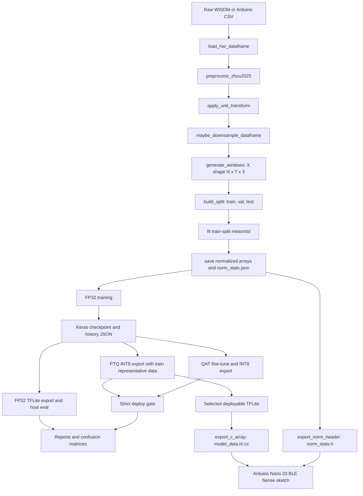
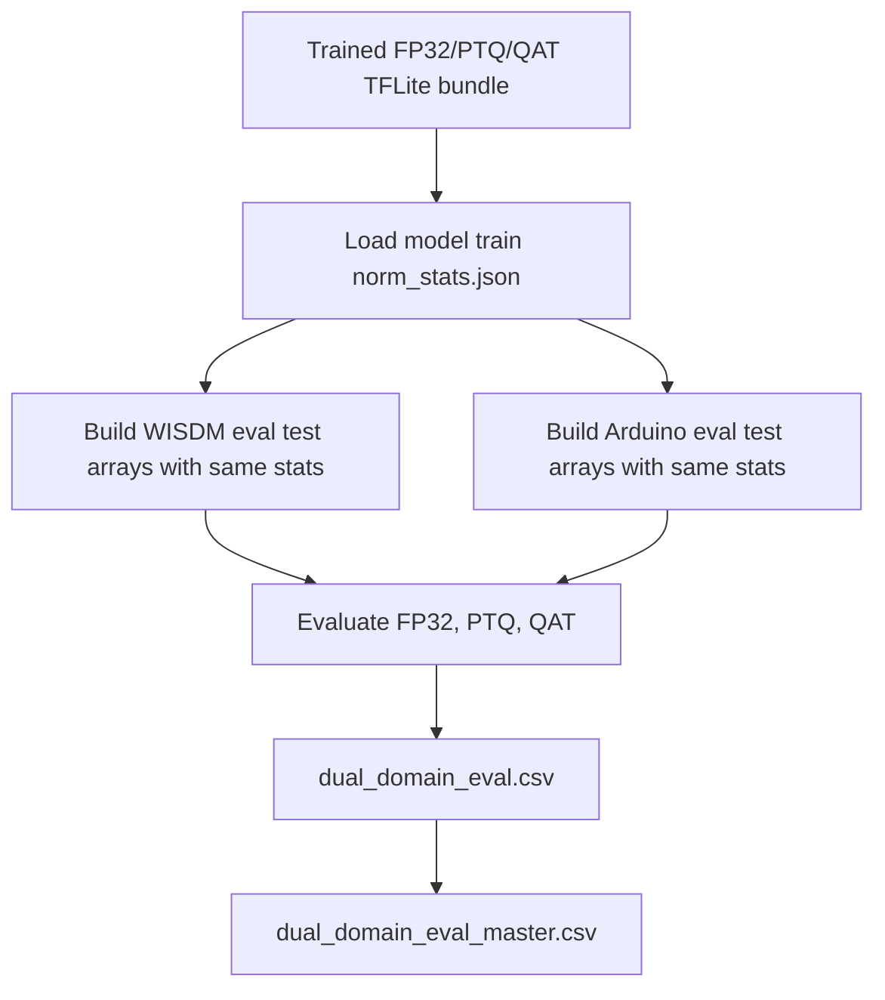
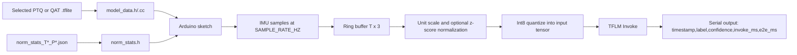

# M3 End-To-End HAR Pipeline

This document describes the code path used for the M3 accelerometer-only HAR experiments with DeepConvLSTM and Daghero, from raw CSV input through training, validation, TFLite evaluation, and Arduino deployment.

## Scope And Invariants

The M3 pipeline is accelerometer-only. The raw schema is:

```text
user,activity,timestamp,x-axis,y-axis,z-axis
```

The model input shape is always `[batch, T, 3]`, where `T` is `100` for the main 5-second 20 Hz runs and `50` for the 2.5-second window ablations. The output shape is `[batch, 6]`, with class order:

```text
Walking, Jogging, Upstairs, Downstairs, Sitting, Standing
```

The Arduino deployment path uses the same three accelerometer channels. We do not add gyroscope or magnetometer inputs, do not change model I/O shape, and do not add inference-time augmentation. Orientation robustness is trained in through optional train-only accelerometer rotation.

| Stage | Input | Output |
| --- | --- | --- |
| Raw load | WISDM-style CSV with `user,activity,timestamp,x-axis,y-axis,z-axis` | Pandas dataframe plus schema/sanity metadata |
| Windowing | Ordered accelerometer rows per user/activity | `X` windows shaped `[N,T,3]`, labels `y`, user ids |
| Splitting | Window arrays and labels | `X_train`, `X_val`, `X_test`, `y_train`, `y_val`, `y_test` |
| Normalization | Raw train/val/test windows | Normalized float32 arrays plus `norm_stats_T*_P*.json` |
| FP32 training | Normalized train windows and one-hot labels | Keras `.keras` checkpoint, history JSON |
| TFLite export | Keras checkpoint and representative train data | FP32 `.tflite`, PTQ INT8 `.tflite`, QAT INT8 `.tflite` |
| Evaluation | Keras checkpoint or TFLite plus normalized test windows | Accuracy, macro-F1, per-class metrics, confusion matrix, model size, dtype/ops/latency |
| Deployment | Selected INT8 `.tflite` plus `norm_stats.json` | `deploy/common/model_data.h`, `model_data.cc`, `norm_stats.h` |

## Pipeline Diagram



## M3 Entry Points

The Slurm wrappers call [src/m3/run_experiment.py](/shared/b00088568/github/har-mcu/src/m3/run_experiment.py), which validates config contracts and dispatches by transfer mode.

| Transfer mode | Code path | Training domain | Evaluation domain | Notes |
| --- | --- | --- | --- | --- |
| `source_only` | [src/run_paper_experiment.py](/shared/b00088568/github/har-mcu/src/run_paper_experiment.py) | WISDM | WISDM | Used by E00 anchor. |
| `zero_shot` | [src/m3/transfer.py](/shared/b00088568/github/har-mcu/src/m3/transfer.py) | WISDM | Arduino | Arduino eval arrays are normalized with source WISDM train stats. |
| `finetune` | [src/m3/transfer.py](/shared/b00088568/github/har-mcu/src/m3/transfer.py) | WISDM pretrain, Arduino fine-tune | Arduino | Final checkpoint and quantization use Arduino fine-tune train stats. |
| `arduino_from_scratch` | [src/run_paper_experiment.py](/shared/b00088568/github/har-mcu/src/run_paper_experiment.py) | Arduino | Arduino | Used by E10 and E12. |

The active M3 configs for the rotation experiments are E00, E03, E04, E05, E06, E07, E08, E09, E10, E11, and E12.

| Experiment | Mode | Source | Train | Eval | T | Target Hz | Normalization | Unit mode | Rotation |
| --- | --- | --- | --- | --- | ---: | ---: | --- | --- | --- |
| `E00_wisdm_m2_anchor` | `source_only` | `wisdm` | `wisdm` | `wisdm` | 100 | 20 | `train_zscore` | `raw_no_conversion` | enabled, p=0.5 |
| `E03_arduino_downsample_20hz_T100` | `zero_shot` | `wisdm_arduino` | `wisdm` | `arduino` | 100 | 20 | `train_zscore` | `raw_no_conversion` | enabled, p=0.5 |
| `E04_wisdm_to_g_arduino_g` | `zero_shot` | `wisdm_arduino` | `wisdm` | `arduino` | 100 | 20 | `train_zscore` | `wisdm_to_g` | enabled, p=0.5 |
| `E05_legacy_arduino_to_mps2` | `zero_shot` | `wisdm_arduino` | `wisdm` | `arduino` | 100 | 20 | `train_zscore` | `arduino_to_mps2_legacy` | enabled, p=0.5 |
| `E06_no_norm_matched` | `zero_shot` | `wisdm_arduino` | `wisdm` | `arduino` | 100 | 20 | `none` | `raw_no_conversion` | enabled, p=0.5 |
| `E07_skip_inference_norm_diag` | `zero_shot` | `wisdm_arduino` | `wisdm` | `arduino` | 100 | 20 | `train_zscore` | `raw_no_conversion` | enabled, p=0.5 |
| `E08_T50_window` | `zero_shot` | `wisdm_arduino` | `wisdm` | `arduino` | 50 | 20 | `train_zscore` | `raw_no_conversion` | enabled, p=0.5 |
| `E09_wisdm_pretrain_arduino_finetune` | `finetune` | `wisdm_arduino` | `arduino` | `arduino` | 100 | 20 | `train_zscore` | `raw_no_conversion` | enabled, p=0.5 |
| `E10_arduino_from_scratch` | `arduino_from_scratch` | `arduino` | `arduino` | `arduino` | 100 | 20 | `train_zscore` | `raw_no_conversion` | enabled, p=0.5 |
| `E11_wisdm_pretrain_arduino_finetune_T50` | `finetune` | `wisdm_arduino` | `arduino` | `arduino` | 50 | 20 | `train_zscore` | `raw_no_conversion` | enabled, p=0.5 |
| `E12_arduino_from_scratch_T50` | `arduino_from_scratch` | `arduino` | `arduino` | `arduino` | 50 | 20 | `train_zscore` | `raw_no_conversion` | enabled, p=0.5 |

E07 is diagnostic-only because it skips inference normalization. It must not be selected as a final deployment candidate.

## Dataset Construction

[src/data/build_dataset.py](/shared/b00088568/github/har-mcu/src/data/build_dataset.py) builds the processed arrays. It loads the configured domain CSV, applies preprocessing, applies an explicit unit transform, optionally downsamples by deterministic integer stride, creates windows, creates train/val/test splits, fits normalization only on the training split, and saves arrays plus metadata.

Important details:

- Preprocessing drops rows with null required fields, drops rows with timestamp `0`, then sorts by `user,timestamp`.
- Axis columns are always `x-axis`, `y-axis`, `z-axis`.
- Windows are generated per user so a window never crosses a user boundary.
- `label_policy: drop_cross_boundary` drops windows whose activity changes inside the window.
- `overlap: 0.5`, so the step is `T / 2`.
- `random_stratified` uses stratified `train_test_split`.
- `user_holdout` tooling exists, but these M3 runs use `random_stratified`.
- Normalization mode `train_zscore` fits per-axis mean/std on `X_train_raw` only, then applies those stats to train, val, and test.
- Normalization mode `none` writes zero mean and unit std and leaves arrays in raw units.

Saved dataset artifacts use this pattern:

```text
data/processed/m3/<experiment_id>/<suffix>/X_train_T<T>_P<protocol>.npy
data/processed/m3/<experiment_id>/<suffix>/X_val_T<T>_P<protocol>.npy
data/processed/m3/<experiment_id>/<suffix>/X_test_T<T>_P<protocol>.npy
data/processed/m3/<experiment_id>/<suffix>/norm_stats_T<T>_P<protocol>.json
data/processed/m3/<experiment_id>/<suffix>/datacard_T<T>_P<protocol>.json
```

For transfer experiments the suffix can include subdirectories such as `source_wisdm`, `eval_arduino`, `pretrain_wisdm`, or `finetune_arduino`.

## Train-Time Rotation Augmentation

[src/train/augment.py](/shared/b00088568/github/har-mcu/src/train/augment.py) implements one augmentation: random 3D rotation of accelerometer windows. It is applied only to training batches and never changes the saved dataset arrays, model input shape, inference preprocessing, PTQ representative dataset, or Arduino code.

The literature source for the idea is accelerometer orientation robustness in HAR:

- Yurtman and Barshan, "Activity Recognition Invariant to Sensor Orientation with Wearable Motion Sensors," Sensors 2017, DOI `10.3390/s17081838`, frames wearable-sensor orientation as a core HAR robustness problem and treats the 3-axis motion signal geometrically under rotations: https://doi.org/10.3390/s17081838.
- Yurtman, Barshan, and Fidan, "Activity Recognition Invariant to Wearable Sensor Unit Orientation Using Differential Rotational Transformations Represented by Quaternions," Sensors 2018, DOI `10.3390/s18082725`, motivates orientation-invariant transformations but also informs our caution: this repo remains accelerometer-only, so we are not claiming full Earth-frame orientation correction and are not adding gyroscope or magnetometer channels: https://doi.org/10.3390/s18082725.
- Caramaschi, Papini, and Caiani, "Device Orientation Independent Human Activity Recognition Model for Patient Monitoring Based on Triaxial Acceleration," Applied Sciences 2023, DOI `10.3390/app13074175`, is the direct data-augmentation precedent: they rotate triaxial accelerometer signals with rotation matrices for device-displacement robustness. From this paper we take the train-time rotation idea and the caution that large rotations can damage walking-like classes when gravity-aligned components carry label information: https://doi.org/10.3390/app13074175.

Our v1 implementation used a single uniformly sampled SO(3) rotation per selected training window. The v2 implementation adds a bounded SO(3) mode that samples one random axis-angle rotation per selected window with the angle limited around identity. The v3 implementation adds `target_gravity`, which uses the current EDA to rotate selected training-window mean gravity directions toward observed Arduino gravity clusters.

```mermaid
flowchart LR
    A[Normalized train window X: T x 3] --> B[Denormalize: X_raw = X * std + mean]
    B --> C[Sample one SO(3) matrix R per selected window]
    C --> D[Rotate all timesteps: X_raw_rot = X_raw * R]
    D --> E[Renormalize: X_rot = (X_raw_rot - mean) / std]
    E --> F[model.fit training batch]
```

Configuration keys:

```yaml
augment:
  accel_rotation:
    enabled: true
    probability: 0.5
    apply_in_qat: true
    mode: uniform_so3
    max_angle_degrees: null
    target_vectors: null
    target_probabilities: null
```

The v2 bounded-rotation run overrides those keys at submission time:

```yaml
augment:
  accel_rotation:
    enabled: true
    probability: 0.25
    apply_in_qat: true
    mode: bounded_so3
    max_angle_degrees: 20
```

The v3 target-orientation run overrides these keys at submission time:

```yaml
augment:
  accel_rotation:
    enabled: true
    probability: 0.25
    apply_in_qat: true
    mode: target_gravity
    target_vectors:
    - [-1, 0, 0]
    - [0, -1, 0]
    - [0, 0, 1]
    target_probabilities: [0.50, 0.25, 0.25]
```

Behavior:

- `enabled: false` fully disables augmentation.
- `probability` is per window.
- `mode: uniform_so3` samples a valid random 3D rotation matrix.
- `mode: bounded_so3` samples a random 3D axis and a random angle in `[-max_angle_degrees, +max_angle_degrees]`.
- `max_angle_degrees` is required for `bounded_so3` and must be in `(0, 180]`.
- `mode: target_gravity` estimates each selected raw window's mean vector, samples one configured target vector, and computes one valid rotation that maps the mean direction toward the target.
- `target_vectors` is required for `target_gravity`; `target_probabilities` is optional and is normalized to sum to one.
- One rotation matrix is shared across all timesteps in a window.
- The helper requires exactly three feature channels.
- Current `X_train` arrays are already z-score normalized, so rotation must not happen directly on those normalized values.
- For each selected training window, the helper loads the saved train-split `mean` and `std`, denormalizes with `X_raw = X_norm * std + mean`, rotates `X_raw`, then re-normalizes with the same train-split stats before yielding the batch.
- Validation arrays and test arrays are passed directly to `model.fit(..., validation_data=(X_val, y_val))` and evaluation. They are not augmented.
- PTQ representative arrays are read by the PTQ converter path and are not passed through the augmentation helper.
- QAT uses the same training-input helper when `apply_in_qat: true`, while its converter representative data stays untouched.
- The augmentation has zero inference-time cost because only the training input object changes.

QAT-specific behavior:

- [src/quant/qat_train.py](/shared/b00088568/github/har-mcu/src/quant/qat_train.py) calls `build_training_input(..., for_qat=True)` before `qat_model.fit(...)`.
- [src/train/augment.py](/shared/b00088568/github/har-mcu/src/train/augment.py) reads `augment.accel_rotation.apply_in_qat`. If it is `true`, QAT receives the same augmented training batches as the FP32/fine-tune stage for the active rotation mode. If it is `false`, QAT receives the plain normalized `X_train` arrays.
- In v1, v2, and v3, `apply_in_qat=true`, so QAT was augmented for the augmentation-on rows:
  - v1 QAT: `uniform_so3`, `probability=0.5`
  - v2 QAT: `bounded_so3`, `max_angle_degrees=20`, `probability=0.25`
  - v3 QAT: `target_gravity`, targets `-x/-y/+z`, `probability=0.25`
- The no-augmentation baseline rows, including no-augmentation QAT, have augmentation disabled and therefore use unaugmented normalized train arrays.
- QAT validation data is not augmented. QAT's representative/calibration data for the final full-integer TFLite conversion is not augmented.
- Recommendation: keep `apply_in_qat=true` for future augmentation ablations so QAT fine-tuning and FP32/fine-tune training see the same training distribution. The current live recommendation is already Daghero E09 v2 QAT, but keep the no-augmentation Daghero E09 QAT export as the control and rollback comparison.

All current M3 v1 rotation configs enable this block with probability `0.5` and `mode=uniform_so3`. [configs/default.yaml](/shared/b00088568/github/har-mcu/configs/default.yaml) keeps it disabled by default. The v2 Slurm wrapper does not edit the YAML files; it overrides the augmentation keys on the command line so v2 outputs stay traceable to their artifact suffix.

Result-driven update:

- The completed clean ablation (`reports/m3/dual_domain_eval/dual_domain_eval_master.csv`) shows that `probability=0.5` with unconstrained `uniform_so3` is not a deployment default. It slightly improves Daghero Arduino macro-F1 in FP32/PTQ/QAT, but hurts WISDM and substantially hurts DeepConvLSTM QAT.
- This matches the paper-derived caution: valid rotations are not automatically useful rotations for every label, especially when the gravity component helps separate static and walking/stairs classes.
- The completed v2 ablation (`reports/m3/dual_domain_eval_v2_bounded20_p025/dual_domain_eval_master.csv`) shows that `bounded_so3`, `max_angle_degrees=20`, and `probability=0.25` is safer than v1. Offline gains are still small, but the latest live deployment pass now favors Daghero E09 v2 QAT because it behaves better on-device even though the stored metrics stay close to the clean baseline. DeepConvLSTM still loses Arduino macro-F1 in FP32/PTQ/QAT and remains the comparison branch.
- Because the stored Arduino test split already gives the best Daghero E09/E10 PTQ/QAT candidates standing and walking recall of `1.0`, this dataset does not reproduce the live Standing-to-Walking failure. With no new live data, the next useful augmentation experiment is target-orientation rotation driven by the existing E04 axis EDA clusters (`-x`, `-y`, and `+z`), not another broad bounded-rotation grid.
- The completed v3 ablation (`reports/m3/dual_domain_eval_v3_target_clusters_p025/dual_domain_eval_master.csv`) shows that `target_gravity`, `probability=0.25`, and targets `-x/-y/+z` is technically valid but still not a deployment default. It improves mean Daghero QAT Arduino macro-F1, but hurts WISDM, does not beat the no-augmentation Daghero E09/E10 deployment candidates, and hurts DeepConvLSTM mean Arduino macro-F1.
- Recommendation from the latest live pass: do not rerun the full offline grids. Deploy Daghero E09 v2 QAT first, keep the no-augmentation Daghero E09 QAT export as control, and spend the next training budget on a narrow T50 v2 follow-up plus logged live robustness trials.

Call sites:

- [src/train/train_baseline.py](/shared/b00088568/github/har-mcu/src/train/train_baseline.py)
- [src/train/train_model.py](/shared/b00088568/github/har-mcu/src/train/train_model.py)
- [src/m3/transfer.py](/shared/b00088568/github/har-mcu/src/m3/transfer.py)
- [src/quant/qat_train.py](/shared/b00088568/github/har-mcu/src/quant/qat_train.py)

## Axis EDA And Domain Shift

[src/m3/axis_eda.py](/shared/b00088568/github/har-mcu/src/m3/axis_eda.py) is the current axis-level EDA entry point for the next experiment cycle. It loads WISDM and Arduino through the same M3 loader, preprocessing, unit transform, and sampling policy as training, then writes:

```text
reports/m3/axis_eda/<run>/sample_axis_summary.csv
reports/m3/axis_eda/<run>/window_axis_summary.csv
reports/m3/axis_eda/<run>/dominant_axis_summary.csv
reports/m3/axis_eda/<run>/axis_eda_report.md
```

Run the current unit-compatible EDA:

```bash
/shared/b00088568/myenvs/tinymlproj/bin/python -m src.m3.axis_eda \
  --config configs/m3/E04_wisdm_to_g_arduino_g.yaml \
  --output-dir reports/m3/axis_eda/e04_g_units
```

Current E04 EDA findings:

- WISDM `Walking`, `Upstairs`, `Downstairs`, and `Standing` are mostly gravity-dominant on `+y`.
- Arduino `Walking` is `-x` dominant, Arduino `Jogging` is mostly `-x`, Arduino `Sitting` is `+z`, and Arduino `Standing` splits between `-x` and `-y`.
- Arduino `Standing` has very low dynamic RMS in the stored CSV, so the live Standing-to-Walking failure is probably not just generic standing motion. It may involve the specific board orientation, on-device sampling cadence, normalization scale, live ring-buffer behavior, or a posture not represented in the Arduino CSV.
- Walking, upstairs, and downstairs remain a hard group because their dynamic energies overlap while the gravity axis also shifts across domains.
- `Standing -> Walking` and `Walking -> Upstairs/Downstairs` are examples of live failures, not the full failure set. Evaluation should keep full confusion matrices and per-class recall, then explicitly extract the standing/walking/stairs confusion pairs for on-device decision making.

This EDA drove v2 bounded rotation and v3 target-orientation rotation. V3 directly used the observed Arduino clusters, but the stored-test results still do not beat the no-augmentation Daghero deployment baseline. The EDA remains important because it shows the domain shift is real, while the experiment results show that the current stored Arduino split is not sufficient to select an augmented model for the live Standing-to-Walking failure.

## Model Architectures

Both deployed variants use Conv2D-safe implementations so TensorFlow Model Optimization Toolkit QAT can annotate supported layers reliably. The external Keras input remains `[batch, T, 3]`.

### DeepConvLSTM

Builder: `build_deepconv_lstm_conv2d` in [src/models/deepconv_lstm.py](/shared/b00088568/github/har-mcu/src/models/deepconv_lstm.py).

Compile function: `compile_deepconv_lstm`.

Optimizer and objective:

- Optimizer: `RMSprop`
- Learning rate: `train.learning_rate`, default `0.001`
- Loss: `categorical_crossentropy`
- Keras metric: `accuracy`

T100 summary:

| Layer | Output shape | Params |
| --- | --- | ---: |
| input | `(None, 100, 3)` | 0 |
| reshape_in | `(None, 100, 1, 3)` | 0 |
| conv1, Conv2D 32 filters `(3,1)`, ReLU | `(None, 98, 1, 32)` | 320 |
| dropout1 | `(None, 98, 1, 32)` | 0 |
| conv2, Conv2D 64 filters `(3,1)`, ReLU | `(None, 96, 1, 64)` | 6,208 |
| dropout2 | `(None, 96, 1, 64)` | 0 |
| reshape_squeeze | `(None, 96, 64)` | 0 |
| lstm, 100 units, return sequences | `(None, 96, 100)` | 66,000 |
| flatten | `(None, 9600)` | 0 |
| dropout3 | `(None, 9600)` | 0 |
| classifier, Dense 6 softmax | `(None, 6)` | 57,606 |
| Total | | 130,134 |

T50 differences:

| Layer | Output shape | Params |
| --- | --- | ---: |
| input | `(None, 50, 3)` | 0 |
| conv1 | `(None, 48, 1, 32)` | 320 |
| conv2 | `(None, 46, 1, 64)` | 6,208 |
| reshape_squeeze | `(None, 46, 64)` | 0 |
| lstm | `(None, 46, 100)` | 66,000 |
| flatten | `(None, 4600)` | 0 |
| classifier | `(None, 6)` | 27,606 |
| Total | | 100,134 |

### Daghero

Builder: `build_daghero_2layer_conv2d` in [src/models/daghero_cnn_searchspace_tf.py](/shared/b00088568/github/har-mcu/src/models/daghero_cnn_searchspace_tf.py).

Compile function: `compile_daghero_cnn`.

Optimizer and objective:

- Optimizer: `Adam`
- Learning rate: `train.learning_rate`, default `0.001`
- Loss: `categorical_crossentropy`
- Keras metric: `accuracy`

T100 summary:

| Layer | Output shape | Params |
| --- | --- | ---: |
| input | `(None, 100, 3)` | 0 |
| reshape_in | `(None, 100, 1, 3)` | 0 |
| conv1, Conv2D 32 filters `(7,1)`, no bias | `(None, 100, 1, 32)` | 672 |
| bn1 | `(None, 100, 1, 32)` | 128 |
| relu1 | `(None, 100, 1, 32)` | 0 |
| pool1, MaxPool2D `(2,1)` | `(None, 50, 1, 32)` | 0 |
| conv2, Conv2D 64 filters `(7,1)`, no bias | `(None, 50, 1, 64)` | 14,336 |
| bn2 | `(None, 50, 1, 64)` | 256 |
| relu2 | `(None, 50, 1, 64)` | 0 |
| pool2, MaxPool2D `(2,1)` | `(None, 25, 1, 64)` | 0 |
| gap, GlobalAveragePooling2D | `(None, 64)` | 0 |
| drop | `(None, 64)` | 0 |
| fc1, Dense 64 ReLU | `(None, 64)` | 4,160 |
| classifier, Dense 6 softmax | `(None, 6)` | 390 |
| Total | | 19,942 |

Trainable params are `19,750`; non-trainable batch-normalization params are `192`.

T50 keeps the same parameter count. The pooling path changes temporal shapes to `50 -> 25 -> 12`, then global average pooling returns `(None, 64)`.

## TFLite Model Sizes

These sizes are from the completed accelerometer-rotation exports under:

```text
models_tflite/m3/<experiment_id>/accel_rotation/<model_variant>/<experiment_code>/
```

| Model | Window | FP32 TFLite KB | PTQ INT8 KB | QAT INT8 KB |
| --- | ---: | ---: | ---: | ---: |
| `deepconv_lstm_conv2d` | 100 | 513.617 | 136.922 | 137.344 |
| `deepconv_lstm_conv2d` | 50 | 396.430 | 107.625 | 108.047 |
| `daghero_cnn_2layer_conv2d` | 100 | 80.406 | 26.133 | 26.734 |
| `daghero_cnn_2layer_conv2d` | 50 | 80.406 | 26.133 | 26.734 |

Representative T100 exports:

```text
models_tflite/m3/E00_wisdm_m2_anchor/accel_rotation/deepconv_lstm_conv2d/e00/deepconv_lstm_conv2d_T100_Prandom_stratified_E00_deepconv_lstm_r0_fp32.tflite
models_tflite/m3/E00_wisdm_m2_anchor/accel_rotation/deepconv_lstm_conv2d/e00/deepconv_lstm_conv2d_T100_Prandom_stratified_E00_deepconv_lstm_r0_ptq_int8.tflite
models_tflite/m3/E00_wisdm_m2_anchor/accel_rotation/deepconv_lstm_conv2d/e00/deepconv_lstm_conv2d_T100_Prandom_stratified_E00_deepconv_lstm_r0_qat.tflite
models_tflite/m3/E00_wisdm_m2_anchor/accel_rotation/daghero_cnn_2layer_conv2d/e00/daghero_cnn_2layer_conv2d_T100_Prandom_stratified_E00_daghero_cnn_2layer_conv2d_r0_fp32.tflite
models_tflite/m3/E00_wisdm_m2_anchor/accel_rotation/daghero_cnn_2layer_conv2d/e00/daghero_cnn_2layer_conv2d_T100_Prandom_stratified_E00_daghero_cnn_2layer_conv2d_r0_ptq_int8.tflite
models_tflite/m3/E00_wisdm_m2_anchor/accel_rotation/daghero_cnn_2layer_conv2d/e00/daghero_cnn_2layer_conv2d_T100_Prandom_stratified_E00_daghero_cnn_2layer_conv2d_r0_qat.tflite
```

## Training, Validation, And Callbacks

FP32 training uses [src/train/train_model.py](/shared/b00088568/github/har-mcu/src/train/train_model.py), or the equivalent fine-tune helper in [src/m3/transfer.py](/shared/b00088568/github/har-mcu/src/m3/transfer.py). Labels are converted to one-hot with `tf.keras.utils.to_categorical`.

Default training settings from [configs/default.yaml](/shared/b00088568/github/har-mcu/configs/default.yaml):

| Setting | Value |
| --- | --- |
| `seed` | `42` |
| `train.learning_rate` | `0.001` |
| `train.batch_size` | `64` |
| `train.epochs` | `50` |
| `train.dropout` | `0.3` for DeepConvLSTM builder; Daghero builder default is `0.2` unless passed through model kwargs |
| `train.reduce_lr_factor` | `0.5` |
| `train.reduce_lr_patience` | `5` |
| `train.early_stopping_patience` | `10` |

FP32 and fine-tune callbacks:

| Callback | Monitor | Behavior |
| --- | --- | --- |
| `ReduceLROnPlateau` | `val_loss` | Multiply LR by `0.5` after 5 plateau epochs. |
| `EarlyStopping` | `val_loss` | Stop after 10 plateau epochs and restore best weights. |

Validation data is passed as `(X_val, y_val_one_hot)` and is never augmented. Test data is not used by `model.fit`.

The FP32 and fine-tune paths save the model after the Keras fit call. If `EarlyStopping(..., restore_best_weights=True)` triggers, the saved Keras checkpoint contains the best validation-loss weights from that fit call. If training reaches the configured epoch limit without early stopping, the saved checkpoint is the final epoch weights.

QAT settings:

| Setting | Value |
| --- | --- |
| `quant.qat.enabled` | `true` |
| `quant.qat.annotation_policy` | `auto` |
| `quant.qat.learning_rate` | `0.0001` |
| `quant.qat.epochs` | `10` |
| `quant.qat.batch_size` | `64` |
| `quant.qat.representative_source` | `train` |
| `quant.qat.representative_samples` | `256` |
| `quant.qat.device_preference` | `gpu` with CPU fallback |

QAT compiles the quantized model with `RMSprop(learning_rate=quant.qat.learning_rate)`, `categorical_crossentropy`, and `accuracy`. The current QAT training loop does not attach early stopping or a learning-rate scheduler; it runs the configured QAT epoch count unless the runtime fails.

## Quantization And Deploy Gate

PTQ is implemented in [src/quant/ptq_full_int8.py](/shared/b00088568/github/har-mcu/src/quant/ptq_full_int8.py). It loads the final FP32 checkpoint, uses `tf.lite.Optimize.DEFAULT`, and calibrates from the configured train split representative data.

QAT is implemented in [src/quant/qat_train.py](/shared/b00088568/github/har-mcu/src/quant/qat_train.py). It loads the FP32 checkpoint, forces a single-batch TFLite-friendly input where possible, applies TF-MOT quantization, trains for the configured QAT epochs, and exports strict full-integer TFLite.

Strict quantization settings:

```yaml
quant:
  ptq:
    representative_source: train
    enforce_full_int8: true
    strict_full_int8: true
    require_tflm_compatible: true
    accepted_integer_io_dtypes: [int8, uint8]
  qat:
    representative_source: train
    enforce_full_int8: true
    strict_full_int8: true
    require_tflm_compatible: true
    accepted_integer_io_dtypes: [int8, uint8]
```

The deploy gate checks full-integer I/O, accepted input/output dtypes, TFLM op compatibility, and unsupported ops using [src/quant/deploy_gate.py](/shared/b00088568/github/har-mcu/src/quant/deploy_gate.py) and the reference op set in [src/deploy/tflm_reference_ops.py](/shared/b00088568/github/har-mcu/src/deploy/tflm_reference_ops.py).

## Evaluation Metrics

Keras checkpoint evaluation is implemented in [src/eval/evaluate_model.py](/shared/b00088568/github/har-mcu/src/eval/evaluate_model.py). TFLite evaluation is implemented in [src/eval/eval_tflite.py](/shared/b00088568/github/har-mcu/src/eval/eval_tflite.py).

Reported metrics and artifacts:

- accuracy
- macro-F1
- per-class precision, recall, F1, and support
- `classification_report`
- confusion matrix JSON
- confusion matrix PNG
- TFLite model size KB
- TFLite input dtype and output dtype
- TFLite interpreter ops and op count
- host-side TFLite latency mean, median, and p95 when timing is enabled
- deploy-gate status for PTQ and QAT

TFLite timing defaults:

```yaml
eval:
  tflite_timing:
    enabled: true
    warmup_samples: 32
    timed_samples: 256
```

The dual-domain eval runner disables timing to keep the comparison focused on correctness metrics and to avoid spending scheduler time on repeated latency sampling.

## Dual-Domain Off/On Comparison

[src/m3/dual_domain_eval.py](/shared/b00088568/github/har-mcu/src/m3/dual_domain_eval.py) evaluates already exported TFLite artifacts on both WISDM and Arduino test splits. It builds eval datasets with the model's saved training mean/std, so each model is scored at the input scale it expects.

For FP32 and fine-tune runs, the evaluated TFLite bundle comes from the saved checkpoint described above. PTQ is converted from that checkpoint. QAT is fine-tuned from that checkpoint and then evaluated as its own INT8 artifact.



Completed comparison outputs:

```text
reports/m3/dual_domain_eval/dual_domain_eval_master.csv
reports/m3/dual_domain_eval/dual_domain_eval_master.md
```

The completed master table has 264 rows: 44 `{experiment, model, augmentation off/on}` combinations times 2 eval domains times 3 tiers.

Completed v2 comparison outputs:

```text
reports/m3/dual_domain_eval_v2_bounded20_p025/dual_domain_eval_master.csv
reports/m3/dual_domain_eval_v2_bounded20_p025/dual_domain_eval_master.md
reports/m3/dual_domain_eval_v2_bounded20_p025/rotation_ablation_summary.csv
reports/m3/dual_domain_eval_v2_bounded20_p025/rotation_ablation_summary.md
reports/m3/dual_domain_eval_v2_bounded20_p025/arduino_failure_focus_delta.csv
reports/m3/dual_domain_eval_v2_bounded20_p025/arduino_failure_focus_delta.md
reports/m3/dual_domain_eval_v2_bounded20_p025/arduino_failure_focus_deployment_subset_delta.csv
reports/m3/dual_domain_eval_v2_bounded20_p025/arduino_failure_focus_deployment_subset_delta.md
```

V2 result summary:

- Training job `7694` and dual-domain eval job `7698` completed with exit `0:0`; no wallclock or missing-artifact errors were found.
- V2 produced 44 per-run CSVs, 264 master rows, and 132 TFLite exports across augmentation on/off.
- Daghero gets small mean Arduino macro-F1 gains across all experiments, but the E09-E12 deployment subset is essentially flat or slightly worse.
- The Daghero mean gains hide a standing-recall regression in the all-experiment failure-focus summary, which reinforces that future decisions should use per-class recall and confusion pairs, not only macro-F1.
- DeepConvLSTM loses Arduino macro-F1 for FP32/PTQ/QAT under v2.
- The best stored-test deployment candidates remain Daghero E09/E10 PTQ/QAT at roughly `26-27 KB`, with standing and walking recall of `1.0` on the stored Arduino test split.

V3 result summary:

- Training job `7714` and dual-domain eval job `7716` completed with exit `0:0`; no wallclock or missing-artifact errors were found.
- V3 produced 44 per-run CSVs, 264 master rows, and 66 augmentation-on TFLite exports. The off rows reuse the clean no-augmentation v2 artifacts.
- Daghero QAT gets a mean Arduino macro-F1 gain across all experiments, but WISDM drops and the E09-E12 deployment subset does not beat the no-augmentation Daghero baseline.
- DeepConvLSTM loses mean Arduino macro-F1 under v3 for FP32/PTQ/QAT.
- Final offline recommendation: rotation augmentation should remain experimental. The deployment reference should be no-augmentation Daghero E09 QAT first, with no-augmentation E09 PTQ as backup.

## Deployment

Deployment export uses:

- [src/deploy/export_c_array.py](/shared/b00088568/github/har-mcu/src/deploy/export_c_array.py) to generate `model_data.h` and `model_data.cc`.
- [src/deploy/export_norm_header.py](/shared/b00088568/github/har-mcu/src/deploy/export_norm_header.py) to generate `norm_stats.h`.
- [deploy/arduino_infer/arduino_infer.ino](/shared/b00088568/github/har-mcu/deploy/arduino_infer/arduino_infer.ino) for live Nano 33 BLE Sense inference.



The Arduino sketch keeps a ring buffer of `WINDOW_SIZE x 3`, samples accelerometer data at `SAMPLE_RATE_HZ`, normalizes with `kNormMean` and `kNormStd` when `APPLY_NORMALIZATION=1`, quantizes normalized values into the model input tensor, invokes TFLM, and prints predicted label plus timing.

No rotation augmentation runs on-device. Its cost is paid only during training.

## Output Locations

Common artifact patterns:

```text
checkpoints/m3/<experiment_id>/<suffix>/<model>_T<T>_P<protocol>_<run_id>.keras
checkpoints/m3/<experiment_id>/<suffix>/<model>_T<T>_P<protocol>_<run_id>_history.json
models_tflite/m3/<experiment_id>/<suffix>/<model>_T<T>_P<protocol>_<run_id>_fp32.tflite
models_tflite/m3/<experiment_id>/<suffix>/<model>_T<T>_P<protocol>_<run_id>_ptq_int8.tflite
models_tflite/m3/<experiment_id>/<suffix>/<model>_T<T>_P<protocol>_<run_id>_qat.tflite
reports/m3/<suffix>/<model_or_paper_reports>/
deploy/common/model_data.h
deploy/common/model_data.cc
deploy/common/norm_stats.h
```

The accelerometer-rotation artifacts are under:

```text
models_tflite/m3/<experiment_id>/accel_rotation/<model_variant>/<experiment_code>/
reports/m3/accel_rotation/<model_variant>/<experiment_code>/
```

The clean no-rotation ablation artifacts are under:

```text
models_tflite/m3/<experiment_id>/no_accel_rotation/<model_variant>/<experiment_code>/
reports/m3/no_accel_rotation/<model_variant>/<experiment_code>/
```

The v2 bounded-rotation artifacts are under:

```text
models_tflite/m3/<experiment_id>/accel_rotation_v2_bounded20_p025/<model_variant>/<experiment_code>/
reports/m3/accel_rotation_v2_bounded20_p025/<model_variant>/<experiment_code>/
```

The v2 no-rotation baseline artifacts are under:

```text
models_tflite/m3/<experiment_id>/no_accel_rotation_v2/<model_variant>/<experiment_code>/
reports/m3/no_accel_rotation_v2/<model_variant>/<experiment_code>/
```

The v3 target-orientation artifacts are under:

```text
models_tflite/m3/<experiment_id>/accel_rotation_v3_target_clusters_p025/<model_variant>/<experiment_code>/
reports/m3/accel_rotation_v3_target_clusters_p025/<model_variant>/<experiment_code>/
```

V1/v2/v3 TFLite artifact map:

| Run | Condition | Artifact suffix | TFLite directory pattern |
| --- | --- | --- | --- |
| v1 | Augmentation on | `accel_rotation` | `models_tflite/m3/<experiment_id>/accel_rotation/<model_variant>/<experiment_code>/` |
| v1 | Augmentation off | `no_accel_rotation` | `models_tflite/m3/<experiment_id>/no_accel_rotation/<model_variant>/<experiment_code>/` |
| v2 | Augmentation on | `accel_rotation_v2_bounded20_p025` | `models_tflite/m3/<experiment_id>/accel_rotation_v2_bounded20_p025/<model_variant>/<experiment_code>/` |
| v2 | Augmentation off | `no_accel_rotation_v2` | `models_tflite/m3/<experiment_id>/no_accel_rotation_v2/<model_variant>/<experiment_code>/` |
| v3 | Augmentation on | `accel_rotation_v3_target_clusters_p025` | `models_tflite/m3/<experiment_id>/accel_rotation_v3_target_clusters_p025/<model_variant>/<experiment_code>/` |
| v3 | Augmentation off | `no_accel_rotation_v2` | v3 reuses the clean v2 no-augmentation baseline. |

Each full suffix currently has 66 TFLite files: 11 experiments times 2 model variants times FP32/PTQ/QAT. The model variants in this rotation comparison are `daghero_cnn_2layer_conv2d` and `deepconv_lstm_conv2d`; the deployment-oriented files end in `_ptq_int8.tflite` or `_qat.tflite`.

Coverage audit on 2026-05-04:

- Excluding user-holdout variants, every non-user-holdout experiment in this repo has complete v1/v2/v3 and clean coverage.
- E10 has full v1/v2/v3 and clean bundles under `models_tflite/m3/E10_arduino_from_scratch/...`.
- E12 has the same complete coverage under `models_tflite/m3/E12_arduino_from_scratch_T50/...` and is the T50 from-scratch analogue of E10.
- Aggregate-only step is now complete for `reports/m3/dual_domain_eval_v2_bounded20_p025_t50/`; `dual_domain_eval_master.csv` and `dual_domain_eval_master.md` summarize 72 rows from 12 source CSVs.
- That T50 master table confirms evaluation coverage for E08, E11, and E12 across augmentation on/off, Daghero and DeepConvLSTM, both WISDM and Arduino test sets, and FP32/PTQ/QAT exports.

The new T50 v2 augmented TFLites are under:

- `models_tflite/m3/E08_T50_window/accel_rotation_v2_bounded20_p025/<model_variant>/e08/`
- `models_tflite/m3/E11_wisdm_pretrain_arduino_finetune_T50/accel_rotation_v2_bounded20_p025/<model_variant>/e11/`
- `models_tflite/m3/E12_arduino_from_scratch_T50/accel_rotation_v2_bounded20_p025/<model_variant>/e12/`

Here `<model_variant>` is `daghero_cnn_2layer_conv2d` or `deepconv_lstm_conv2d`. Each directory contains FP32, PTQ INT8, and QAT INT8 TFLites. The paired clean T50 controls live under the same experiment roots with `no_accel_rotation_v2`.

The dual-domain comparison artifacts are under:

```text
reports/m3/dual_domain_eval/<augment_label>/<model_variant>/<experiment_code>/
reports/m3/dual_domain_eval/dual_domain_eval_master.csv
reports/m3/dual_domain_eval/dual_domain_eval_master.md
reports/m3/dual_domain_eval/rotation_ablation_summary.csv
reports/m3/dual_domain_eval/rotation_ablation_summary.md
```

The v2 dual-domain comparison artifacts are under:

```text
reports/m3/dual_domain_eval_v2_bounded20_p025/<augment_label>/<model_variant>/<experiment_code>/
reports/m3/dual_domain_eval_v2_bounded20_p025/dual_domain_eval_master.csv
reports/m3/dual_domain_eval_v2_bounded20_p025/dual_domain_eval_master.md
reports/m3/dual_domain_eval_v2_bounded20_p025/rotation_ablation_summary.csv
reports/m3/dual_domain_eval_v2_bounded20_p025/rotation_ablation_summary.md
```

The v3 dual-domain comparison artifacts are under:

```text
reports/m3/dual_domain_eval_v3_target_clusters_p025/<augment_label>/<model_variant>/<experiment_code>/
reports/m3/dual_domain_eval_v3_target_clusters_p025/dual_domain_eval_master.csv
reports/m3/dual_domain_eval_v3_target_clusters_p025/dual_domain_eval_master.md
reports/m3/dual_domain_eval_v3_target_clusters_p025/rotation_ablation_summary.csv
reports/m3/dual_domain_eval_v3_target_clusters_p025/rotation_ablation_summary.md
reports/m3/dual_domain_eval_v3_target_clusters_p025/arduino_failure_focus_delta.csv
reports/m3/dual_domain_eval_v3_target_clusters_p025/arduino_failure_focus_delta.md
reports/m3/dual_domain_eval_v3_target_clusters_p025/arduino_failure_focus_deployment_subset_delta.csv
reports/m3/dual_domain_eval_v3_target_clusters_p025/arduino_failure_focus_deployment_subset_delta.md
reports/m3/dual_domain_eval_v3_target_clusters_p025/rotation_strategy_recommendation.md
```

## Slurm Commands

Run clean full-dataset DeepConvLSTM and Daghero M3 training for both augmentation conditions:

```bash
bash scripts/slurm/submit_m3_rotation_ablation_train.sh
```

Run dual-domain off/on TFLite evaluation after the clean training array succeeds. This evaluates 44 `{experiment, model, augment off/on}` rows as 11 Slurm array tasks, with each matrix row producing 2 domains x 3 tiers:

```bash
M3_SLURM_DEPENDENCY=afterok:<TRAIN_ARRAY_JOBID> \
M3_DUAL_EVAL_TASK_START=0 \
M3_DUAL_EVAL_TASK_LIMIT=44 \
M3_DUAL_EVAL_TASKS_PER_ARRAY_TASK=4 \
M3_DUAL_EVAL_ARRAY_CONCURRENCY=11 \
bash scripts/slurm/submit_m3_dual_domain_eval.sh
```

Aggregate dual-domain results:

```bash
/shared/b00088568/myenvs/tinymlproj/bin/python -m src.m3.dual_domain_eval --aggregate-only --output-dir reports/m3/dual_domain_eval
```

Run v2 bounded-rotation training for DeepConvLSTM and Daghero with a fresh v2 no-augmentation baseline:

```bash
bash scripts/slurm/submit_m3_rotation_v2_train.sh
```

Run v2 dual-domain evaluation after that training array succeeds:

```bash
M3_SLURM_DEPENDENCY=afterok:<TRAIN_ARRAY_JOBID> \
bash scripts/slurm/submit_m3_rotation_v2_dual_eval.sh
```

Aggregate v2 dual-domain results:

```bash
/shared/b00088568/myenvs/tinymlproj/bin/python -m src.m3.dual_domain_eval --aggregate-only --output-dir reports/m3/dual_domain_eval_v2_bounded20_p025
```

Run v3 target-orientation training for DeepConvLSTM and Daghero. This trains only augmentation-on artifacts and reuses the clean no-augmentation v2 artifacts as the off baseline:

```bash
bash scripts/slurm/submit_m3_rotation_v3_train.sh
```

Run v3 dual-domain evaluation after that training array succeeds:

```bash
M3_SLURM_DEPENDENCY=afterok:<TRAIN_ARRAY_JOBID> \
bash scripts/slurm/submit_m3_rotation_v3_dual_eval.sh
```

Aggregate v3 dual-domain results:

```bash
/shared/b00088568/myenvs/tinymlproj/bin/python -m src.m3.dual_domain_eval --aggregate-only --output-dir reports/m3/dual_domain_eval_v3_target_clusters_p025
```

Current deployment guideline after v3 results:

- Prefer Daghero over DeepConvLSTM for first on-device testing because Daghero's INT8 artifacts are about `26-27 KB` and the v2 Daghero QAT branch is currently the best live model.
- The live recommendation has moved to the v2 augmented branch even though the offline tables remain close to the clean baseline.
- Use only one TFLite and its matching normalization header in `deploy/common` at a time, and keep the clean no-augmentation Daghero export as the rollback control.

Recommended on-device candidates:

| Priority | Architecture | Tier | Experiment | Window | Augmentation | Stored Arduino summary |
| --- | --- | --- | --- | ---: | --- | --- |
| 1 | Daghero | QAT INT8 | E09 WISDM pretrain + Arduino fine-tune | T100 | v2 on | Current best overall live candidate: walking, jogging, sitting, and standing are stable in informal live testing; upstairs usually works; downstairs often flips to upstairs with low confidence; size about `26.7 KB`. |
| 2 | Daghero | PTQ INT8 | E09 WISDM pretrain + Arduino fine-tune | T100 | v2 on | Backup if QAT is unstable on-device; same augmentation policy and small footprint. |
| 3 | Daghero | QAT INT8 | E09 WISDM pretrain + Arduino fine-tune | T100 | v2 off | Offline control and rollback candidate if the augmented advantage does not reproduce tomorrow. |
| 4 | DeepConvLSTM | PTQ INT8 | E09 WISDM pretrain + Arduino fine-tune | T100 | v2 on | Architecture comparison only; standing improved versus the earlier no-augmentation live pass, but walking still tends to drift to upstairs. |

Recommended pretraining-ablation follow-up:

- After the main E09 live pass, deploy E10 Daghero v2 QAT on-device. This is the cleanest way to test whether WISDM pretraining plus Arduino fine-tuning is actually necessary.
- Use E12 Daghero v2 QAT as the matching T50 from-scratch comparison. That is the effective "E10 with augmentations at T=50" run in this experiment ladder.
- E10 Daghero v2 QAT path: `models_tflite/m3/E10_arduino_from_scratch/accel_rotation_v2_bounded20_p025/daghero_cnn_2layer_conv2d/e10/daghero_cnn_2layer_conv2d_T100_Prandom_stratified_E10_daghero_cnn_2layer_conv2d_r0_qat.tflite`
- E12 Daghero v2 QAT path: `models_tflite/m3/E12_arduino_from_scratch_T50/accel_rotation_v2_bounded20_p025/daghero_cnn_2layer_conv2d/e12/daghero_cnn_2layer_conv2d_T50_Prandom_stratified_E12_daghero_cnn_2layer_conv2d_r0_qat.tflite`

Daghero QAT first candidate:

```text
models_tflite/m3/E09_wisdm_pretrain_arduino_finetune/accel_rotation_v2_bounded20_p025/daghero_cnn_2layer_conv2d/e09/daghero_cnn_2layer_conv2d_T100_Prandom_stratified_E09_daghero_cnn_2layer_conv2d_r0_qat.tflite
data/processed/m3/E09_wisdm_pretrain_arduino_finetune/accel_rotation_v2_bounded20_p025/daghero_cnn_2layer_conv2d/e09/finetune_arduino/norm_stats_T100_Prandom_stratified.json
```

Daghero PTQ backup:

```text
models_tflite/m3/E09_wisdm_pretrain_arduino_finetune/accel_rotation_v2_bounded20_p025/daghero_cnn_2layer_conv2d/e09/daghero_cnn_2layer_conv2d_T100_Prandom_stratified_E09_daghero_cnn_2layer_conv2d_r0_ptq_int8.tflite
data/processed/m3/E09_wisdm_pretrain_arduino_finetune/accel_rotation_v2_bounded20_p025/daghero_cnn_2layer_conv2d/e09/finetune_arduino/norm_stats_T100_Prandom_stratified.json
```

Daghero no-augmentation control:

```text
models_tflite/m3/E09_wisdm_pretrain_arduino_finetune/no_accel_rotation_v2/daghero_cnn_2layer_conv2d/e09/daghero_cnn_2layer_conv2d_T100_Prandom_stratified_E09_daghero_cnn_2layer_conv2d_r0_qat.tflite
data/processed/m3/E09_wisdm_pretrain_arduino_finetune/no_accel_rotation_v2/daghero_cnn_2layer_conv2d/e09/finetune_arduino/norm_stats_T100_Prandom_stratified.json
```

DeepConvLSTM PTQ architecture comparison:

```text
models_tflite/m3/E09_wisdm_pretrain_arduino_finetune/accel_rotation_v2_bounded20_p025/deepconv_lstm_conv2d/e09/deepconv_lstm_conv2d_T100_Prandom_stratified_E09_deepconv_lstm_r0_ptq_int8.tflite
data/processed/m3/E09_wisdm_pretrain_arduino_finetune/accel_rotation_v2_bounded20_p025/deepconv_lstm_conv2d/e09/finetune_arduino/norm_stats_T100_Prandom_stratified.json
```

Normalization and augmentation at deployment:

- The primary live candidate above comes from `accel_rotation_v2_bounded20_p025`; the clean `no_accel_rotation_v2` Daghero E09 QAT artifact is the control and rollback model.
- For all runs, normalization stats are fitted on the training split only. Validation and test arrays are normalized with those same stats and are not augmented.
- For E09/E11 fine-tune models, use `finetune_arduino/norm_stats_*.json` because the final train split is the Arduino fine-tune split.
- On-device, export that JSON into `deploy/common/norm_stats.h`. The Arduino sketch applies the same z-score normalization to each raw IMU sample before quantizing into the TFLM input tensor.
- No augmentation runs on-device. Rotation augmentation was train-only in v1/v2/v3 and has zero inference-time cost.
- For augmented QAT artifacts, the QAT fine-tuning stage did use augmentation because v1/v2/v3 set `apply_in_qat=true`; this still affects training only and does not change the deployed Arduino preprocessing path.
- The main observed v2 Daghero failures were low-confidence ambiguities, especially downstairs into upstairs. Tomorrow's live session should log confidence and placement so those failure modes can be counted directly.

Augmented comparison candidates, to test only after the no-augmentation Daghero baseline:

| Priority | Architecture | Run | Tier | Experiment | Augmentation policy | Stored Arduino summary |
| --- | --- | --- | --- | --- | --- | --- |
| 1 | Daghero | v2 | QAT INT8 | E09 | `bounded_so3`, `20deg`, `p=0.25` | Current best live model: stable walking/jogging/sitting/standing, good upstairs, weak downstairs, small footprint. |
| 2 | Daghero | v2 | PTQ INT8 | E09 | `bounded_so3`, `20deg`, `p=0.25` | Fallback if the QAT export is unstable on-device. |
| 3 | Daghero | v3 | QAT INT8 | E09 | `target_gravity`, `p=0.25`, targets `-x/-y/+z` | EDA-informed alternative if v2 still struggles after tomorrow's live pass. |
| 4 | DeepConvLSTM | v2 | PTQ INT8 | E09 | `bounded_so3`, `20deg`, `p=0.25` | Architecture comparison only; standing is better than before, but walking still tends to move toward upstairs. |

V2 Daghero QAT augmented candidate:

```text
models_tflite/m3/E09_wisdm_pretrain_arduino_finetune/accel_rotation_v2_bounded20_p025/daghero_cnn_2layer_conv2d/e09/daghero_cnn_2layer_conv2d_T100_Prandom_stratified_E09_daghero_cnn_2layer_conv2d_r0_qat.tflite
data/processed/m3/E09_wisdm_pretrain_arduino_finetune/accel_rotation_v2_bounded20_p025/daghero_cnn_2layer_conv2d/e09/finetune_arduino/norm_stats_T100_Prandom_stratified.json
```

V3 Daghero QAT augmented candidate:

```text
models_tflite/m3/E09_wisdm_pretrain_arduino_finetune/accel_rotation_v3_target_clusters_p025/daghero_cnn_2layer_conv2d/e09/daghero_cnn_2layer_conv2d_T100_Prandom_stratified_E09_daghero_cnn_2layer_conv2d_r0_qat.tflite
data/processed/m3/E09_wisdm_pretrain_arduino_finetune/accel_rotation_v3_target_clusters_p025/daghero_cnn_2layer_conv2d/e09/finetune_arduino/norm_stats_T100_Prandom_stratified.json
```

V1 Daghero QAT augmented reference:

```text
models_tflite/m3/E09_wisdm_pretrain_arduino_finetune/accel_rotation/daghero_cnn_2layer_conv2d/e09/daghero_cnn_2layer_conv2d_T100_Prandom_stratified_E09_daghero_cnn_2layer_conv2d_r0_qat.tflite
data/processed/m3/E09_wisdm_pretrain_arduino_finetune/accel_rotation/daghero_cnn_2layer_conv2d/e09/finetune_arduino/norm_stats_T100_Prandom_stratified.json
```

V2 DeepConvLSTM PTQ augmented comparison:

```text
models_tflite/m3/E09_wisdm_pretrain_arduino_finetune/accel_rotation_v2_bounded20_p025/deepconv_lstm_conv2d/e09/deepconv_lstm_conv2d_T100_Prandom_stratified_E09_deepconv_lstm_r0_ptq_int8.tflite
data/processed/m3/E09_wisdm_pretrain_arduino_finetune/accel_rotation_v2_bounded20_p025/deepconv_lstm_conv2d/e09/finetune_arduino/norm_stats_T100_Prandom_stratified.json
```

Export commands for the first candidate:

```bash
/shared/b00088568/myenvs/tinymlproj/bin/python -m src.deploy.export_c_array \
  --tflite models_tflite/m3/E09_wisdm_pretrain_arduino_finetune/accel_rotation_v2_bounded20_p025/daghero_cnn_2layer_conv2d/e09/daghero_cnn_2layer_conv2d_T100_Prandom_stratified_E09_daghero_cnn_2layer_conv2d_r0_qat.tflite \
  --out-dir deploy/common

/shared/b00088568/myenvs/tinymlproj/bin/python -m src.deploy.export_norm_header \
  --norm-json data/processed/m3/E09_wisdm_pretrain_arduino_finetune/accel_rotation_v2_bounded20_p025/daghero_cnn_2layer_conv2d/e09/finetune_arduino/norm_stats_T100_Prandom_stratified.json \
  --out deploy/common/norm_stats.h
```

T50 follow-up status:

- Submit the v2 bounded-rotation T50 runs for E08, E11, and E12 on both Daghero and DeepConvLSTM.
- Evaluate FP32/PTQ/QAT on both WISDM and Arduino.
- Use the T50 results to test whether a shorter window reduces downstairs-to-upstairs confusion and transition-window spillover into walking.
- Submitted on 2026-05-04 as training Slurm job `7758` with dependent dual-domain eval job `7759`.
- Completion check: all `7758_*` and `7759_*` tasks finished `COMPLETED` with exit code `0:0`. Log review found no tracebacks, missing-artifact errors, cancellations, or timeouts.
- Aggregate-only step completed: `reports/m3/dual_domain_eval_v2_bounded20_p025_t50/dual_domain_eval_master.csv` and `.md` are now generated.

## AllocateTensors failures: embedded model must be aligned

### Symptom

On Nano 33 BLE, `AllocateTensors()` could appear to **hang**, require **double reset**, or fault **silently** right after `[boot] allocate tensors…`. Increasing `kTensorArenaSize` did not fix it when the real issue was elsewhere.

### Cause

The model is embedded as a **C byte array** (`const unsigned char …[]`). Without alignment constraints, the **linker may place that array at any address**. Example from two builds of the same sketch:

- One link placed the array at **`0x5555c`** — **16-byte aligned** by luck.
- Another placed it at **`0x55ac1`** — **unaligned**.

During `AllocateTensors()`, TensorFlow Lite reads the flatbuffer as **structured data** (tables, offsets, vectors). On **Cortex-M**, reading multi-byte fields from an **unaligned** base address can cause a **hard fault** instead of returning `kTfLiteError`. That matches “stuck at allocate tensors” with no clean error path.

### Fix

Declare the embedded model with **16-byte alignment** (flatbuffers often assume aligned access for internal offsets):

```cpp
alignas(16) const unsigned char my_model_tflite[] = { ... };
```

Regenerate deployment headers from the export scripts so every new `.tflite` → `.h` emit uses `alignas(16)`. In this repo, `har-mcu/src/deploy/export_c_array.py` writes the array that way; always **re-export** after changing models instead of hand-copying a bare `const unsigned char[]`.

After the fix, verify in a map file or debugger that the model symbol lands on a **16-byte boundary** (e.g. `0x55ad0`). Flash alignment issues are **orthogonal** to arena size: a correctly aligned model can still need a larger arena for a bigger graph, but **no arena size fixes an unaligned flatbuffer**.

## Flash vs SRAM: model flatbuffer vs tensor arena

On Arduino Nano 33 BLE (nRF52840, **256 KiB SRAM**), three numbers often confuse people because they sound related but are not:

| Quantity | Typical role | Where it lives |
| --- | --- | --- |
| **Model flatbuffer size** (`model_flatbuffer_len` or `.tflite` file size) | Serialized graph + **weights/biases** (INT8) + quantization metadata | **Flash** (`.rodata`), constant at runtime |
| **`kTensorArenaSize` (allocated arena)** | Upper bound you reserve for TFLite Micro scratch memory | **SRAM** (`tensor_arena[]` in BSS) |
| **`interpreter->arena_used_bytes()`** | Bytes TFLite actually uses inside that arena after `AllocateTensors()` | Subset of the allocated arena only |

**Weights do not live in the tensor arena.** During `Invoke()`, kernels read weights directly from the flatbuffer in flash. The arena holds **scratch RAM** for the interpreter: activations (layer outputs), temporary buffers for ops, and planner bookkeeping. TFLite Micro **reuses** the same arena bytes across operators, so the planner tracks **peak** activation memory — not “sum of every layer’s activations.”

So it is normal — and common for small CNNs — for **model size in flash (e.g. ~27 KiB)** to be **much larger** than **arena used (e.g. ~8 KiB)**. The flatbuffer is dominated by parameters; the arena is dominated by **peak intermediate tensor sizes**, which can stay small if channels stay narrow.

**Allocated vs used arena:** If `arena_used_bytes()` is far below `kTensorArenaSize`, the difference is **slack**: you could shrink `kTensorArenaSize` to reclaim SRAM for larger session buffers or BLE, as long as you leave a safety margin (allocation can shift slightly with resolver/TFLM version).

## Arena size vs inference latency

**Small arena does not imply fast inference.** Arena size tracks **peak scratch RAM** and planner reuse. Latency on Cortex-M4 is dominated by **compute** (MAC operations per layer), filter sizes, and window length `T`, not by how many KiB of arena you reserved. A weight-heavy but activation-narrow CNN can show **small arena_used** and still **~150 ms** per `Invoke()` on this MCU.

Use **measured `invoke_ms`** (from the sketch) or estimated MAC counts from the graph for latency reporting — not arena bytes alone.

## On-device SRAM breakdown (reference)

The BLE deployment sketch (`deploy/m3_nano_int8_ble_imu/m3_nano_int8_ble_imu.ino`) prints a **`[mem]`** block after tensor allocation that summarizes:

- **Tensor arena:** allocated size, **used** (`arena_used_bytes()`), **slack**
- **Session buffer:** `sizeof(g_session_buffer)` — float ring for recording (dominant non-arena SRAM when `kMaxSessionSamples` is large)
- **Trial logits / misc:** cumulative trial buffers and confusion matrix helpers
- **Static total:** arena allocation plus those named buffers (does **not** include stack, Cordio/BLE heap, or other mbed internals)
- **Model flash:** same byte count as `model_flatbuffer_len`, labeled explicitly as **not SRAM**

Use that block when filling deployment tables that ask for “arena size + additional buffers.”

## Mapping to common deployment metrics

| Metric | Where to read it |
| --- | --- |
| Model size (flash), KiB | `model_flatbuffer_len=` at boot, or size of the `.tflite` file on disk |
| Total sketch flash | Arduino IDE compile output: “Sketch uses X bytes …” |
| Arena allocated | `kTensorArenaSize` and/or `[mem] tensor arena … alloc` |
| Arena actually used | `[mem] … used` = `interpreter->arena_used_bytes()` |
| Extra SRAM buffers | `[mem]` lines for session / trial / misc + `static total` |
| Inference latency (avg ≥ 50) | Per-window `invoke_ms=` lines; long-hold summary `per_trial: invoke_ms=` |

---
