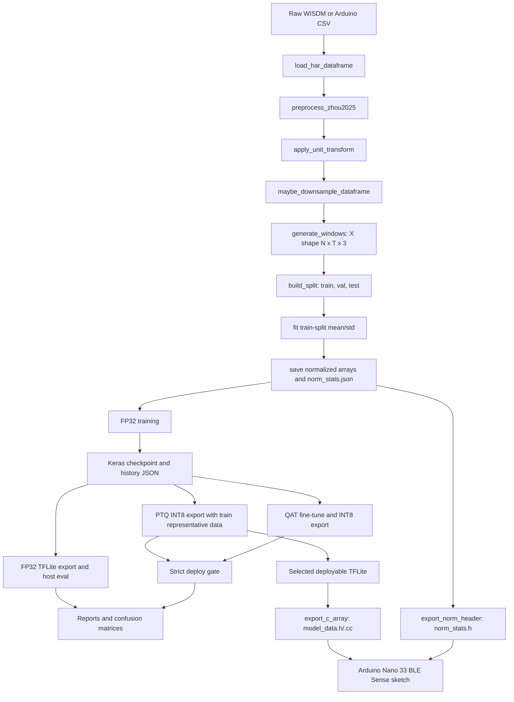
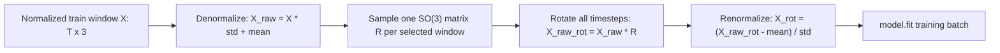
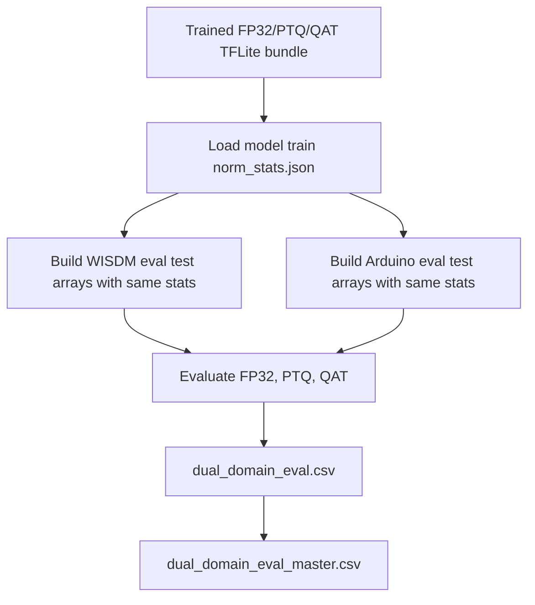
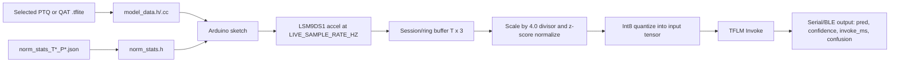
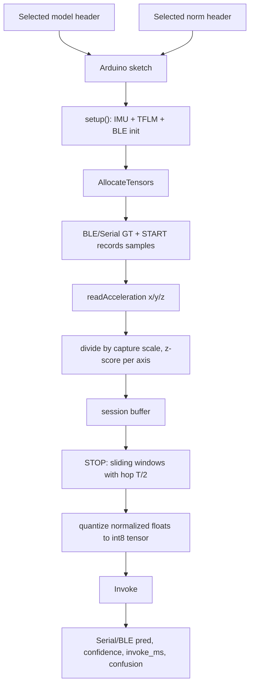

# M3 End-To-End HAR Pipeline

This document describes the code path used for the M3 accelerometer-only HAR experiments with DeepConvLSTM and Daghero, from raw CSV input through training, validation, TFLite evaluation, and Arduino deployment.

**Table of contents**

- [Scope And Invariants](#scope-and-invariants)
- [Pipeline Diagram](#pipeline-diagram)
- [M3 Entry Points](#m3-entry-points)
- [Dataset Construction](#dataset-construction)
- [Train-Time Rotation Augmentation](#train-time-rotation-augmentation)
- [Axis EDA And Domain Shift](#axis-eda-and-domain-shift)
- [Model Architectures](#model-architectures)
  - [DeepConvLSTM](#deepconvlstm)
  - [Daghero](#daghero)
- [TFLite Model Sizes](#tflite-model-sizes)
- [Published Reference Comparison Used In M4](#published-reference-comparison-used-in-m4)
- [Training, Validation, And Callbacks](#training-validation-and-callbacks)
- [Quantization And Deploy Gate](#quantization-and-deploy-gate)
- [Evaluation Metrics](#evaluation-metrics)
- [Dual-Domain Off/On Comparison](#dual-domain-offon-comparison)
- [Deployment](#deployment)
- [Code-Referenced Demo Q&A](#code-referenced-demo-qa)
- [Output Locations](#output-locations)
- [Slurm Commands](#slurm-commands)
- [AllocateTensors failures: embedded model must be aligned](#allocatetensors-failures-embedded-model-must-be-aligned)
  - [Symptom](#symptom)
  - [Cause](#cause)
  - [Fix](#fix)
- [Live BLE and Serial Control](#live-ble-and-serial-control)
  - [How to run](#how-to-run)
  - [Desktop controller architecture](#desktop-controller-architecture)
  - [GATT service](#gatt-service)
  - [Command bytes](#command-bytes)
  - [Status notify payload](#status-notify-payload)
  - [Sketch control surface](#sketch-control-surface)
  - [BLE and Serial output](#ble-and-serial-output)
  - [Robustness notes](#robustness-notes)
- [Flash vs SRAM: model flatbuffer vs tensor arena](#flash-vs-sram-model-flatbuffer-vs-tensor-arena)
- [Arena size vs inference latency](#arena-size-vs-inference-latency)
- [On-device SRAM breakdown (reference)](#on-device-sram-breakdown-reference)
- [Mapping to common deployment metrics](#mapping-to-common-deployment-metrics)

## Scope And Invariants

The M3 pipeline is accelerometer-only. The raw schema is:

```text
user,activity,timestamp,x-axis,y-axis,z-axis
```

The model input shape is always `[batch, T, 3]`, where `T` is `100` for the main 5-second 20 Hz runs and `50` for the 2.5-second window ablations. The output shape is `[batch, 6]`, with class order:

```text
Walking, Jogging, Upstairs, Downstairs, Sitting, Standing
```

The Arduino deployment path uses the same three accelerometer channels. We do not add gyroscope or magnetometer inputs, do not change model I/O shape, and do not add inference-time augmentation. Orientation robustness is trained in through optional train-only accelerometer rotation.

| Stage | Input | Output |
| --- | --- | --- |
| Raw load | WISDM-style CSV with `user,activity,timestamp,x-axis,y-axis,z-axis` | Pandas dataframe plus schema/sanity metadata |
| Windowing | Ordered accelerometer rows per user/activity | `X` windows shaped `[N,T,3]`, labels `y`, user ids |
| Splitting | Window arrays and labels | `X_train`, `X_val`, `X_test`, `y_train`, `y_val`, `y_test` |
| Normalization | Raw train/val/test windows | Normalized float32 arrays plus `norm_stats_T*_P*.json` |
| FP32 training | Normalized train windows and one-hot labels | Keras `.keras` checkpoint, history JSON |
| TFLite export | Keras checkpoint and representative train data | FP32 `.tflite`, PTQ INT8 `.tflite`, QAT INT8 `.tflite` |
| Evaluation | Keras checkpoint or TFLite plus normalized test windows | Accuracy, macro-F1, per-class metrics, confusion matrix, model size, dtype/ops/latency |
| Deployment | Selected INT8 `.tflite` plus `norm_stats.json` | `deploy/common/model_data.h`, `model_data.cc`, `norm_stats.h` |

## Pipeline Diagram



## M3 Entry Points

The Slurm wrappers call [src/m3/run_experiment.py](/shared/b00088568/github/har-mcu/src/m3/run_experiment.py), which validates config contracts and dispatches by transfer mode.

| Transfer mode | Code path | Training domain | Evaluation domain | Notes |
| --- | --- | --- | --- | --- |
| `source_only` | [src/run_paper_experiment.py](/shared/b00088568/github/har-mcu/src/run_paper_experiment.py) | WISDM | WISDM | Used by E00 anchor. |
| `zero_shot` | [src/m3/transfer.py](/shared/b00088568/github/har-mcu/src/m3/transfer.py) | WISDM | Arduino | Arduino eval arrays are normalized with source WISDM train stats. |
| `finetune` | [src/m3/transfer.py](/shared/b00088568/github/har-mcu/src/m3/transfer.py) | WISDM pretrain, Arduino fine-tune | Arduino | Final checkpoint and quantization use Arduino fine-tune train stats. |
| `arduino_from_scratch` | [src/run_paper_experiment.py](/shared/b00088568/github/har-mcu/src/run_paper_experiment.py) | Arduino | Arduino | Used by E10 and E12. |

The active M3 configs for the rotation experiments are E00, E03, E04, E05, E06, E07, E08, E09, E10, E11, and E12.

| Experiment | Mode | Source | Train | Eval | T | Target Hz | Normalization | Unit mode | Rotation |
| --- | --- | --- | --- | --- | ---: | ---: | --- | --- | --- |
| `E00_wisdm_m2_anchor` | `source_only` | `wisdm` | `wisdm` | `wisdm` | 100 | 20 | `train_zscore` | `raw_no_conversion` | enabled, p=0.5 |
| `E03_arduino_downsample_20hz_T100` | `zero_shot` | `wisdm_arduino` | `wisdm` | `arduino` | 100 | 20 | `train_zscore` | `raw_no_conversion` | enabled, p=0.5 |
| `E04_wisdm_to_g_arduino_g` | `zero_shot` | `wisdm_arduino` | `wisdm` | `arduino` | 100 | 20 | `train_zscore` | `wisdm_to_g` | enabled, p=0.5 |
| `E05_legacy_arduino_to_mps2` | `zero_shot` | `wisdm_arduino` | `wisdm` | `arduino` | 100 | 20 | `train_zscore` | `arduino_to_mps2_legacy` | enabled, p=0.5 |
| `E06_no_norm_matched` | `zero_shot` | `wisdm_arduino` | `wisdm` | `arduino` | 100 | 20 | `none` | `raw_no_conversion` | enabled, p=0.5 |
| `E07_skip_inference_norm_diag` | `zero_shot` | `wisdm_arduino` | `wisdm` | `arduino` | 100 | 20 | `train_zscore` | `raw_no_conversion` | enabled, p=0.5 |
| `E08_T50_window` | `zero_shot` | `wisdm_arduino` | `wisdm` | `arduino` | 50 | 20 | `train_zscore` | `raw_no_conversion` | enabled, p=0.5 |
| `E09_wisdm_pretrain_arduino_finetune` | `finetune` | `wisdm_arduino` | `arduino` | `arduino` | 100 | 20 | `train_zscore` | `raw_no_conversion` | enabled, p=0.5 |
| `E10_arduino_from_scratch` | `arduino_from_scratch` | `arduino` | `arduino` | `arduino` | 100 | 20 | `train_zscore` | `raw_no_conversion` | enabled, p=0.5 |
| `E11_wisdm_pretrain_arduino_finetune_T50` | `finetune` | `wisdm_arduino` | `arduino` | `arduino` | 50 | 20 | `train_zscore` | `raw_no_conversion` | enabled, p=0.5 |
| `E12_arduino_from_scratch_T50` | `arduino_from_scratch` | `arduino` | `arduino` | `arduino` | 50 | 20 | `train_zscore` | `raw_no_conversion` | enabled, p=0.5 |

E07 is diagnostic-only because it skips inference normalization. It must not be selected as a final deployment candidate.

## Dataset Construction

[src/data/build_dataset.py](/shared/b00088568/github/har-mcu/src/data/build_dataset.py) builds the processed arrays. It loads the configured domain CSV, applies preprocessing, applies an explicit unit transform, optionally downsamples by deterministic integer stride, creates windows, creates train/val/test splits, fits normalization only on the training split, and saves arrays plus metadata.

Important details:

- Preprocessing drops rows with null required fields, drops rows with timestamp `0`, then sorts by `user,timestamp`.
- Axis columns are always `x-axis`, `y-axis`, `z-axis`.
- Windows are generated per user so a window never crosses a user boundary.
- `label_policy: drop_cross_boundary` drops windows whose activity changes inside the window.
- `overlap: 0.5`, so the step is `T / 2`.
- `random_stratified` uses stratified `train_test_split`.
- `user_holdout` tooling exists, but these M3 runs use `random_stratified`.
- Normalization mode `train_zscore` fits per-axis mean/std on `X_train_raw` only, then applies those stats to train, val, and test.
- Normalization mode `none` writes zero mean and unit std and leaves arrays in raw units.

Saved dataset artifacts use this pattern:

```text
data/processed/m3/<experiment_id>/<suffix>/X_train_T<T>_P<protocol>.npy
data/processed/m3/<experiment_id>/<suffix>/X_val_T<T>_P<protocol>.npy
data/processed/m3/<experiment_id>/<suffix>/X_test_T<T>_P<protocol>.npy
data/processed/m3/<experiment_id>/<suffix>/norm_stats_T<T>_P<protocol>.json
data/processed/m3/<experiment_id>/<suffix>/datacard_T<T>_P<protocol>.json
```

For transfer experiments the suffix can include subdirectories such as `source_wisdm`, `eval_arduino`, `pretrain_wisdm`, or `finetune_arduino`.

## Train-Time Rotation Augmentation

[src/train/augment.py](/shared/b00088568/github/har-mcu/src/train/augment.py) implements one augmentation: random 3D rotation of accelerometer windows. It is applied only to training batches and never changes the saved dataset arrays, model input shape, inference preprocessing, PTQ representative dataset, or Arduino code.

The literature source for the idea is accelerometer orientation robustness in HAR:

- Yurtman and Barshan, "Activity Recognition Invariant to Sensor Orientation with Wearable Motion Sensors," Sensors 2017, DOI `10.3390/s17081838`, frames wearable-sensor orientation as a core HAR robustness problem and treats the 3-axis motion signal geometrically under rotations: https://doi.org/10.3390/s17081838.
- Yurtman, Barshan, and Fidan, "Activity Recognition Invariant to Wearable Sensor Unit Orientation Using Differential Rotational Transformations Represented by Quaternions," Sensors 2018, DOI `10.3390/s18082725`, motivates orientation-invariant transformations but also informs our caution: this repo remains accelerometer-only, so we are not claiming full Earth-frame orientation correction and are not adding gyroscope or magnetometer channels: https://doi.org/10.3390/s18082725.
- Caramaschi, Papini, and Caiani, "Device Orientation Independent Human Activity Recognition Model for Patient Monitoring Based on Triaxial Acceleration," Applied Sciences 2023, DOI `10.3390/app13074175`, is the direct data-augmentation precedent: they rotate triaxial accelerometer signals with rotation matrices for device-displacement robustness. From this paper we take the train-time rotation idea and the caution that large rotations can damage walking-like classes when gravity-aligned components carry label information: https://doi.org/10.3390/app13074175.

Our v1 implementation used a single uniformly sampled SO(3) rotation per selected training window. The v2 implementation adds a bounded SO(3) mode that samples one random axis-angle rotation per selected window with the angle limited around identity. The v3 implementation adds `target_gravity`, which uses the current EDA to rotate selected training-window mean gravity directions toward observed Arduino gravity clusters.



In GitHub-flavored Mermaid, **unquoted** text inside `Node[...]` can break when the label contains parentheses (e.g. `SO(3)`) or math punctuation - the parser may treat `(` as starting another node shape. **Wrap those labels in double quotes** as above.

Configuration keys:

```yaml
augment:
  accel_rotation:
    enabled: true
    probability: 0.5
    apply_in_qat: true
    mode: uniform_so3
    max_angle_degrees: null
    target_vectors: null
    target_probabilities: null
```

The v2 bounded-rotation run overrides those keys at submission time:

```yaml
augment:
  accel_rotation:
    enabled: true
    probability: 0.25
    apply_in_qat: true
    mode: bounded_so3
    max_angle_degrees: 20
```

The v3 target-orientation run overrides these keys at submission time:

```yaml
augment:
  accel_rotation:
    enabled: true
    probability: 0.25
    apply_in_qat: true
    mode: target_gravity
    target_vectors:
    - [-1, 0, 0]
    - [0, -1, 0]
    - [0, 0, 1]
    target_probabilities: [0.50, 0.25, 0.25]
```

Behavior:

- `enabled: false` fully disables augmentation.
- `probability` is per window.
- `mode: uniform_so3` samples a valid random 3D rotation matrix.
- `mode: bounded_so3` samples a random 3D axis and a random angle in `[-max_angle_degrees, +max_angle_degrees]`.
- `max_angle_degrees` is required for `bounded_so3` and must be in `(0, 180]`.
- `mode: target_gravity` estimates each selected raw window's mean vector, samples one configured target vector, and computes one valid rotation that maps the mean direction toward the target.
- `target_vectors` is required for `target_gravity`; `target_probabilities` is optional and is normalized to sum to one.
- One rotation matrix is shared across all timesteps in a window.
- The helper requires exactly three feature channels.
- Current `X_train` arrays are already z-score normalized, so rotation must not happen directly on those normalized values.
- For each selected training window, the helper loads the saved train-split `mean` and `std`, denormalizes with `X_raw = X_norm * std + mean`, rotates `X_raw`, then re-normalizes with the same train-split stats before yielding the batch.
- Validation arrays and test arrays are passed directly to `model.fit(..., validation_data=(X_val, y_val))` and evaluation. They are not augmented.
- PTQ representative arrays are read by the PTQ converter path and are not passed through the augmentation helper.
- QAT uses the same training-input helper when `apply_in_qat: true`, while its converter representative data stays untouched.
- The augmentation has zero inference-time cost because only the training input object changes.

QAT-specific behavior:

- [src/quant/qat_train.py](/shared/b00088568/github/har-mcu/src/quant/qat_train.py) calls `build_training_input(..., for_qat=True)` before `qat_model.fit(...)`.
- [src/train/augment.py](/shared/b00088568/github/har-mcu/src/train/augment.py) reads `augment.accel_rotation.apply_in_qat`. If it is `true`, QAT receives the same augmented training batches as the FP32/fine-tune stage for the active rotation mode. If it is `false`, QAT receives the plain normalized `X_train` arrays.
- In v1, v2, and v3, `apply_in_qat=true`, so QAT was augmented for the augmentation-on rows:
  - v1 QAT: `uniform_so3`, `probability=0.5`
  - v2 QAT: `bounded_so3`, `max_angle_degrees=20`, `probability=0.25`
  - v3 QAT: `target_gravity`, targets `-x/-y/+z`, `probability=0.25`
- The no-augmentation baseline rows, including no-augmentation QAT, have augmentation disabled and therefore use unaugmented normalized train arrays.
- QAT validation data is not augmented. QAT's representative/calibration data for the final full-integer TFLite conversion is not augmented.
- Recommendation: keep `apply_in_qat=true` for future augmentation ablations so QAT fine-tuning and FP32/fine-tune training see the same training distribution. The current live recommendation is already Daghero E09 v2 QAT, but keep the no-augmentation Daghero E09 QAT export as the control and rollback comparison.

Why augment during QAT as well as FP32/fine-tuning:

- The deployed QAT artifact is not just the FP32 model converted after training. QAT wraps the model with fake-quantization behavior, recompiles it, and runs additional training epochs before exporting INT8. In [src/quant/qat_train.py](/shared/b00088568/github/har-mcu/src/quant/qat_train.py): lines 454-486, the QAT model is built, compiled, given a training input, and fit again.
- If FP32/fine-tune training used rotation augmentation but QAT did not, the last trainable stage would optimize only on clean normalized windows. That can partially wash out the robustness learned earlier, because the final deployed weights are the post-QAT weights.
- Keeping `apply_in_qat=true` makes QAT see the same train-time robustness policy that produced the FP32/fine-tuned checkpoint, while still validating on clean `X_val` and converting/calibrating with unaugmented representative arrays. The config switch remains useful: setting `apply_in_qat=false` is a valid ablation if we want to measure whether augmentation-only-before-QAT is enough for a specific model.
- Augmenting only pretraining/fine-tuning might be enough when QAT uses very few epochs, a very small learning rate, frozen layers, or empirical results show no difference. That is not guaranteed, and our selected deployable artifact is QAT, so the conservative training contract is to include the same augmentation in QAT and let clean validation/test decide whether it helped.

All current M3 v1 rotation configs enable this block with probability `0.5` and `mode=uniform_so3`. [configs/default.yaml](/shared/b00088568/github/har-mcu/configs/default.yaml) keeps it disabled by default. The v2 Slurm wrapper does not edit the YAML files; it overrides the augmentation keys on the command line so v2 outputs stay traceable to their artifact suffix.

Result-driven update:

- The completed clean ablation (`reports/m3/dual_domain_eval/dual_domain_eval_master.csv`) shows that `probability=0.5` with unconstrained `uniform_so3` is not a deployment default. It slightly improves Daghero Arduino macro-F1 in FP32/PTQ/QAT, but hurts WISDM and substantially hurts DeepConvLSTM QAT.
- This matches the paper-derived caution: valid rotations are not automatically useful rotations for every label, especially when the gravity component helps separate static and walking/stairs classes.
- The completed v2 ablation (`reports/m3/dual_domain_eval_v2_bounded20_p025/dual_domain_eval_master.csv`) shows that `bounded_so3`, `max_angle_degrees=20`, and `probability=0.25` is safer than v1. Offline gains are still small, but the latest live deployment pass now favors Daghero E09 v2 QAT because it behaves better on-device even though the stored metrics stay close to the clean baseline. DeepConvLSTM still loses Arduino macro-F1 in FP32/PTQ/QAT and remains the comparison branch.
- Because the stored Arduino test split already gives the best Daghero E09/E10 PTQ/QAT candidates standing and walking recall of `1.0`, this dataset does not reproduce the live Standing-to-Walking failure. With no new live data, the next useful augmentation experiment is target-orientation rotation driven by the existing E04 axis EDA clusters (`-x`, `-y`, and `+z`), not another broad bounded-rotation grid.
- The completed v3 ablation (`reports/m3/dual_domain_eval_v3_target_clusters_p025/dual_domain_eval_master.csv`) shows that `target_gravity`, `probability=0.25`, and targets `-x/-y/+z` is technically valid but still not a deployment default. It improves mean Daghero QAT Arduino macro-F1, but hurts WISDM, does not beat the no-augmentation Daghero E09/E10 deployment candidates, and hurts DeepConvLSTM mean Arduino macro-F1.
- Recommendation from the latest live pass: do not rerun the full offline grids. Deploy Daghero E09 v2 QAT first, keep the no-augmentation Daghero E09 QAT export as control, and spend the next training budget on a narrow T50 v2 follow-up plus logged live robustness trials.

Call sites:

- [src/train/train_baseline.py](/shared/b00088568/github/har-mcu/src/train/train_baseline.py)
- [src/train/train_model.py](/shared/b00088568/github/har-mcu/src/train/train_model.py)
- [src/m3/transfer.py](/shared/b00088568/github/har-mcu/src/m3/transfer.py)
- [src/quant/qat_train.py](/shared/b00088568/github/har-mcu/src/quant/qat_train.py)

## Axis EDA And Domain Shift

[src/m3/axis_eda.py](/shared/b00088568/github/har-mcu/src/m3/axis_eda.py) is the current axis-level EDA entry point for the next experiment cycle. It loads WISDM and Arduino through the same M3 loader, preprocessing, unit transform, and sampling policy as training, then writes:

```text
reports/m3/axis_eda/<run>/sample_axis_summary.csv
reports/m3/axis_eda/<run>/window_axis_summary.csv
reports/m3/axis_eda/<run>/dominant_axis_summary.csv
reports/m3/axis_eda/<run>/axis_eda_report.md
```

Run the current unit-compatible EDA:

```bash
/shared/b00088568/myenvs/tinymlproj/bin/python -m src.m3.axis_eda \
  --config configs/m3/E04_wisdm_to_g_arduino_g.yaml \
  --output-dir reports/m3/axis_eda/e04_g_units
```

Current E04 EDA findings:

- WISDM `Walking`, `Upstairs`, `Downstairs`, and `Standing` are mostly gravity-dominant on `+y`.
- Arduino `Walking` is `-x` dominant, Arduino `Jogging` is mostly `-x`, Arduino `Sitting` is `+z`, and Arduino `Standing` splits between `-x` and `-y`.
- Arduino `Standing` has very low dynamic RMS in the stored CSV, so the live Standing-to-Walking failure is probably not just generic standing motion. It may involve the specific board orientation, on-device sampling cadence, normalization scale, live ring-buffer behavior, or a posture not represented in the Arduino CSV.
- Walking, upstairs, and downstairs remain a hard group because their dynamic energies overlap while the gravity axis also shifts across domains.
- `Standing -> Walking` and `Walking -> Upstairs/Downstairs` are examples of live failures, not the full failure set. Evaluation should keep full confusion matrices and per-class recall, then explicitly extract the standing/walking/stairs confusion pairs for on-device decision making.

This EDA drove v2 bounded rotation and v3 target-orientation rotation. V3 directly used the observed Arduino clusters, but the stored-test results still do not beat the no-augmentation Daghero deployment baseline. The EDA remains important because it shows the domain shift is real, while the experiment results show that the current stored Arduino split is not sufficient to select an augmented model for the live Standing-to-Walking failure.

## Model Architectures

Both deployed variants use Conv2D-safe implementations so TensorFlow Model Optimization Toolkit QAT can annotate supported layers reliably. The external Keras input remains `[batch, T, 3]`.

### DeepConvLSTM

Builder: `build_deepconv_lstm_conv2d` in [src/models/deepconv_lstm.py](/shared/b00088568/github/har-mcu/src/models/deepconv_lstm.py).

Compile function: `compile_deepconv_lstm`.

Optimizer and objective:

- Optimizer: `RMSprop`
- Learning rate: `train.learning_rate`, default `0.001`
- Loss: `categorical_crossentropy`
- Keras metric: `accuracy`

T100 summary:

| Layer | Output shape | Params |
| --- | --- | ---: |
| input | `(None, 100, 3)` | 0 |
| reshape_in | `(None, 100, 1, 3)` | 0 |
| conv1, Conv2D 32 filters `(3,1)`, ReLU | `(None, 98, 1, 32)` | 320 |
| dropout1 | `(None, 98, 1, 32)` | 0 |
| conv2, Conv2D 64 filters `(3,1)`, ReLU | `(None, 96, 1, 64)` | 6,208 |
| dropout2 | `(None, 96, 1, 64)` | 0 |
| reshape_squeeze | `(None, 96, 64)` | 0 |
| lstm, 100 units, return sequences | `(None, 96, 100)` | 66,000 |
| flatten | `(None, 9600)` | 0 |
| dropout3 | `(None, 9600)` | 0 |
| classifier, Dense 6 softmax | `(None, 6)` | 57,606 |
| Total | | 130,134 |

T50 differences:

| Layer | Output shape | Params |
| --- | --- | ---: |
| input | `(None, 50, 3)` | 0 |
| conv1 | `(None, 48, 1, 32)` | 320 |
| conv2 | `(None, 46, 1, 64)` | 6,208 |
| reshape_squeeze | `(None, 46, 64)` | 0 |
| lstm | `(None, 46, 100)` | 66,000 |
| flatten | `(None, 4600)` | 0 |
| classifier | `(None, 6)` | 27,606 |
| Total | | 100,134 |

### Daghero

Builder: `build_daghero_2layer_conv2d` in [src/models/daghero_cnn_searchspace_tf.py](/shared/b00088568/github/har-mcu/src/models/daghero_cnn_searchspace_tf.py).

Compile function: `compile_daghero_cnn`.

Optimizer and objective:

- Optimizer: `Adam`
- Learning rate: `train.learning_rate`, default `0.001`
- Loss: `categorical_crossentropy`
- Keras metric: `accuracy`

T100 summary:

| Layer | Output shape | Params |
| --- | --- | ---: |
| input | `(None, 100, 3)` | 0 |
| reshape_in | `(None, 100, 1, 3)` | 0 |
| conv1, Conv2D 32 filters `(7,1)`, no bias | `(None, 100, 1, 32)` | 672 |
| bn1 | `(None, 100, 1, 32)` | 128 |
| relu1 | `(None, 100, 1, 32)` | 0 |
| pool1, MaxPool2D `(2,1)` | `(None, 50, 1, 32)` | 0 |
| conv2, Conv2D 64 filters `(7,1)`, no bias | `(None, 50, 1, 64)` | 14,336 |
| bn2 | `(None, 50, 1, 64)` | 256 |
| relu2 | `(None, 50, 1, 64)` | 0 |
| pool2, MaxPool2D `(2,1)` | `(None, 25, 1, 64)` | 0 |
| gap, GlobalAveragePooling2D | `(None, 64)` | 0 |
| drop | `(None, 64)` | 0 |
| fc1, Dense 64 ReLU | `(None, 64)` | 4,160 |
| classifier, Dense 6 softmax | `(None, 6)` | 390 |
| Total | | 19,942 |

Trainable params are `19,750`; non-trainable batch-normalization params are `192`.

T50 keeps the same parameter count. The pooling path changes temporal shapes to `50 -> 25 -> 12`, then global average pooling returns `(None, 64)`.

## TFLite Model Sizes

These sizes are from the completed accelerometer-rotation exports under:

```text
models_tflite/m3/<experiment_id>/accel_rotation/<model_variant>/<experiment_code>/
```

| Model | Window | FP32 TFLite KB | PTQ INT8 KB | QAT INT8 KB |
| --- | ---: | ---: | ---: | ---: |
| `deepconv_lstm_conv2d` | 100 | 513.617 | 136.922 | 137.344 |
| `deepconv_lstm_conv2d` | 50 | 396.430 | 107.625 | 108.047 |
| `daghero_cnn_2layer_conv2d` | 100 | 80.406 | 26.133 | 26.734 |
| `daghero_cnn_2layer_conv2d` | 50 | 80.406 | 26.133 | 26.734 |

Representative T100 exports:

```text
models_tflite/m3/E00_wisdm_m2_anchor/accel_rotation/deepconv_lstm_conv2d/e00/deepconv_lstm_conv2d_T100_Prandom_stratified_E00_deepconv_lstm_r0_fp32.tflite
models_tflite/m3/E00_wisdm_m2_anchor/accel_rotation/deepconv_lstm_conv2d/e00/deepconv_lstm_conv2d_T100_Prandom_stratified_E00_deepconv_lstm_r0_ptq_int8.tflite
models_tflite/m3/E00_wisdm_m2_anchor/accel_rotation/deepconv_lstm_conv2d/e00/deepconv_lstm_conv2d_T100_Prandom_stratified_E00_deepconv_lstm_r0_qat.tflite
models_tflite/m3/E00_wisdm_m2_anchor/accel_rotation/daghero_cnn_2layer_conv2d/e00/daghero_cnn_2layer_conv2d_T100_Prandom_stratified_E00_daghero_cnn_2layer_conv2d_r0_fp32.tflite
models_tflite/m3/E00_wisdm_m2_anchor/accel_rotation/daghero_cnn_2layer_conv2d/e00/daghero_cnn_2layer_conv2d_T100_Prandom_stratified_E00_daghero_cnn_2layer_conv2d_r0_ptq_int8.tflite
models_tflite/m3/E00_wisdm_m2_anchor/accel_rotation/daghero_cnn_2layer_conv2d/e00/daghero_cnn_2layer_conv2d_T100_Prandom_stratified_E00_daghero_cnn_2layer_conv2d_r0_qat.tflite
```

## Published Reference Comparison Used In M4

`paper/M4.tex` compares the closest published reference numbers against our current implementation. This is not a perfectly apples-to-apples benchmark table because the hardware stacks and quantization formats differ, but it is the most honest way to explain how our implementation relates to the papers we used.

| System | Domain/protocol | Reported score | Footprint/latency | Interpretation |
| --- | --- | --- | --- | --- |
| Published DeepConv LSTM edge reference, Zhou et al. 2025 | WISDM, 3-axis accelerometer, Edge Impulse deployment on Arduino Nano 33 BLE Sense Rev2 | 98.24% accuracy, 98.23% F1; quantized about 97% accuracy/F1 | 513.23 KB to 136.51 KB; 29.1 KB RAM, 189.6 KB flash, 21 ms | This is the closest published WISDM/edge DeepConvLSTM reference for our project. |
| Our DeepConvLSTM E00 source anchor | WISDM random-stratified T100 | FP32: 97.83% accuracy, 96.82% macro-F1; PTQ: 97.88% accuracy, 96.93% macro-F1 | 513.617 KB FP32; 136.922 KB PTQ | Similar size/performance scale, but our local TFLM LSTM deployment path is much slower than the optimized Edge Impulse reference. |
| Published Daghero CNN, Daghero et al. 2022 | WISDM and other HAR datasets on Quentin RISC-V MCU | WISDM max F1 98.9%; Max-5% point F1 94.74% | Max point: 6.22 KB, 4.19 ms; Max-5%: 1.27 KB, 1.07 ms | This motivates the lightweight-CNN direction; their mixed/sub-byte backend is not directly comparable to our TFLite flatbuffer size. |
| Our Daghero E00 source anchor | WISDM random-stratified T100 | v2 QAT: 99.41% accuracy, 99.18% macro-F1 | 26.734 KB TFLite flatbuffer | Confirms our Daghero implementation is a strong WISDM classifier and much smaller than DeepConvLSTM in TFLite form. |
| Our final Daghero E09 deployment branch | WISDM pretrain plus Arduino fine-tune, v2 bounded rotation, Arduino held-out test | 99.56% accuracy, 99.56% macro-F1; stored-test Walking/Standing recall 1.0 | 26.734 KB flatbuffer; mean live `Invoke()` about 68.6 ms | Final deployment choice because it gives the best size/latency/accuracy/live-behavior balance in this repo. |

Source traceability:

- Original DeepConvLSTM architecture: Ordonez and Roggen, "Deep Convolutional and LSTM Recurrent Neural Networks for Multimodal Wearable Activity Recognition," Sensors 2016, DOI `10.3390/s16010115`.
- DeepConvLSTM reference: Zhou et al., "Efficient human activity recognition on edge devices using DeepConv LSTM architectures," Scientific Reports 2025, DOI `10.1038/s41598-025-98571-2`.
- Daghero reference: Daghero et al., "Human Activity Recognition on Microcontrollers with Quantized and Adaptive Deep Neural Networks," ACM TECS 2022, DOI `10.1145/3542819`.

The TikZ diagrams in `paper/M4.tex` mirror this Markdown file's Mermaid diagrams:

- End-to-end training/evaluation/deployment flow from [Pipeline Diagram](#pipeline-diagram).
- Train-time rotation augmentation flow from [Train-Time Rotation Augmentation](#train-time-rotation-augmentation).
- Arduino deployment flow from [Deployment](#deployment).

## Training, Validation, And Callbacks

FP32 training uses [src/train/train_model.py](/shared/b00088568/github/har-mcu/src/train/train_model.py), or the equivalent fine-tune helper in [src/m3/transfer.py](/shared/b00088568/github/har-mcu/src/m3/transfer.py). Labels are converted to one-hot with `tf.keras.utils.to_categorical`.

Default training settings from [configs/default.yaml](/shared/b00088568/github/har-mcu/configs/default.yaml):

| Setting | Value |
| --- | --- |
| `seed` | `42` |
| `train.learning_rate` | `0.001` |
| `train.batch_size` | `64` |
| `train.epochs` | `50` |
| `train.dropout` | `0.3` for DeepConvLSTM builder; Daghero builder default is `0.2` unless passed through model kwargs |
| `train.reduce_lr_factor` | `0.5` |
| `train.reduce_lr_patience` | `5` |
| `train.early_stopping_patience` | `10` |

FP32 and fine-tune callbacks:

| Callback | Monitor | Behavior |
| --- | --- | --- |
| `ReduceLROnPlateau` | `val_loss` | Multiply LR by `0.5` after 5 plateau epochs. |
| `EarlyStopping` | `val_loss` | Stop after 10 plateau epochs and restore best weights. |

Validation data is passed as `(X_val, y_val_one_hot)` and is never augmented. Test data is not used by `model.fit`.

The FP32 and fine-tune paths save the model after the Keras fit call. If `EarlyStopping(..., restore_best_weights=True)` triggers, the saved Keras checkpoint contains the best validation-loss weights from that fit call. If training reaches the configured epoch limit without early stopping, the saved checkpoint is the final epoch weights.

QAT settings:

| Setting | Value |
| --- | --- |
| `quant.qat.enabled` | `true` |
| `quant.qat.annotation_policy` | `auto` |
| `quant.qat.learning_rate` | `0.0001` |
| `quant.qat.epochs` | `10` |
| `quant.qat.batch_size` | `64` |
| `quant.qat.representative_source` | `train` |
| `quant.qat.representative_samples` | `256` |
| `quant.qat.device_preference` | `gpu` with CPU fallback |

QAT compiles the quantized model with `RMSprop(learning_rate=quant.qat.learning_rate)`, `categorical_crossentropy`, and `accuracy`. The current QAT training loop does not attach early stopping or a learning-rate scheduler; it runs the configured QAT epoch count unless the runtime fails.

## Quantization And Deploy Gate

PTQ is implemented in [src/quant/ptq_full_int8.py](/shared/b00088568/github/har-mcu/src/quant/ptq_full_int8.py). It loads the final FP32 checkpoint, uses `tf.lite.Optimize.DEFAULT`, and calibrates from the configured train split representative data.

QAT is implemented in [src/quant/qat_train.py](/shared/b00088568/github/har-mcu/src/quant/qat_train.py). It loads the FP32 checkpoint, forces a single-batch TFLite-friendly input where possible, applies TF-MOT quantization, trains for the configured QAT epochs, and exports strict full-integer TFLite.

Strict quantization settings:

```yaml
quant:
  ptq:
    representative_source: train
    enforce_full_int8: true
    strict_full_int8: true
    require_tflm_compatible: true
    accepted_integer_io_dtypes: [int8, uint8]
  qat:
    representative_source: train
    enforce_full_int8: true
    strict_full_int8: true
    require_tflm_compatible: true
    accepted_integer_io_dtypes: [int8, uint8]
```

The deploy gate checks full-integer I/O, accepted input/output dtypes, TFLM op compatibility, and unsupported ops using [src/quant/deploy_gate.py](/shared/b00088568/github/har-mcu/src/quant/deploy_gate.py) and the reference op set in [src/deploy/tflm_reference_ops.py](/shared/b00088568/github/har-mcu/src/deploy/tflm_reference_ops.py).

## Evaluation Metrics

Keras checkpoint evaluation is implemented in [src/eval/evaluate_model.py](/shared/b00088568/github/har-mcu/src/eval/evaluate_model.py). TFLite evaluation is implemented in [src/eval/eval_tflite.py](/shared/b00088568/github/har-mcu/src/eval/eval_tflite.py).

Reported metrics and artifacts:

- accuracy
- macro-F1
- per-class precision, recall, F1, and support
- `classification_report`
- confusion matrix JSON
- confusion matrix PNG
- TFLite model size KB
- TFLite input dtype and output dtype
- TFLite interpreter ops and op count
- host-side TFLite latency mean, median, and p95 when timing is enabled
- deploy-gate status for PTQ and QAT

TFLite timing defaults:

```yaml
eval:
  tflite_timing:
    enabled: true
    warmup_samples: 32
    timed_samples: 256
```

The dual-domain eval runner disables timing to keep the comparison focused on correctness metrics and to avoid spending scheduler time on repeated latency sampling.

## Dual-Domain Off/On Comparison

[src/m3/dual_domain_eval.py](/shared/b00088568/github/har-mcu/src/m3/dual_domain_eval.py) evaluates already exported TFLite artifacts on both WISDM and Arduino test splits. It builds eval datasets with the model's saved training mean/std, so each model is scored at the input scale it expects.

For FP32 and fine-tune runs, the evaluated TFLite bundle comes from the saved checkpoint described above. PTQ is converted from that checkpoint. QAT is fine-tuned from that checkpoint and then evaluated as its own INT8 artifact.



Completed comparison outputs:

```text
reports/m3/dual_domain_eval/dual_domain_eval_master.csv
reports/m3/dual_domain_eval/dual_domain_eval_master.md
```

The completed master table has 264 rows: 44 `{experiment, model, augmentation off/on}` combinations times 2 eval domains times 3 tiers.

Completed v2 comparison outputs:

```text
reports/m3/dual_domain_eval_v2_bounded20_p025/dual_domain_eval_master.csv
reports/m3/dual_domain_eval_v2_bounded20_p025/dual_domain_eval_master.md
reports/m3/dual_domain_eval_v2_bounded20_p025/rotation_ablation_summary.csv
reports/m3/dual_domain_eval_v2_bounded20_p025/rotation_ablation_summary.md
reports/m3/dual_domain_eval_v2_bounded20_p025/arduino_failure_focus_delta.csv
reports/m3/dual_domain_eval_v2_bounded20_p025/arduino_failure_focus_delta.md
reports/m3/dual_domain_eval_v2_bounded20_p025/arduino_failure_focus_deployment_subset_delta.csv
reports/m3/dual_domain_eval_v2_bounded20_p025/arduino_failure_focus_deployment_subset_delta.md
```

V2 result summary:

- Training job `7694` and dual-domain eval job `7698` completed with exit `0:0`; no wallclock or missing-artifact errors were found.
- V2 produced 44 per-run CSVs, 264 master rows, and 132 TFLite exports across augmentation on/off.
- Daghero gets small mean Arduino macro-F1 gains across all experiments, but the E09-E12 deployment subset is essentially flat or slightly worse.
- The Daghero mean gains hide a standing-recall regression in the all-experiment failure-focus summary, which reinforces that future decisions should use per-class recall and confusion pairs, not only macro-F1.
- DeepConvLSTM loses Arduino macro-F1 for FP32/PTQ/QAT under v2.
- The best stored-test deployment candidates remain Daghero E09/E10 PTQ/QAT at roughly `26-27 KB`, with standing and walking recall of `1.0` on the stored Arduino test split.

V3 result summary:

- Training job `7714` and dual-domain eval job `7716` completed with exit `0:0`; no wallclock or missing-artifact errors were found.
- V3 produced 44 per-run CSVs, 264 master rows, and 66 augmentation-on TFLite exports. The off rows reuse the clean no-augmentation v2 artifacts.
- Daghero QAT gets a mean Arduino macro-F1 gain across all experiments, but WISDM drops and the E09-E12 deployment subset does not beat the no-augmentation Daghero baseline.
- DeepConvLSTM loses mean Arduino macro-F1 under v3 for FP32/PTQ/QAT.
- Final deployment recommendation: use the v2 augmented Daghero E09 QAT branch for live deployment, while keeping the clean no-augmentation Daghero E09 QAT export as the offline control and rollback. This is a live-deployment decision: the stored Arduino metrics are very close, but v2 directly targets the board-orientation failure and behaved better in informal live screening.

## Deployment

Deployment export uses:

- [src/deploy/export_c_array.py](/shared/b00088568/github/har-mcu/src/deploy/export_c_array.py) to generate `model_data.h` and `model_data.cc`.
- [src/deploy/export_norm_header.py](/shared/b00088568/github/har-mcu/src/deploy/export_norm_header.py) to generate `norm_stats.h`.
- [deploy/m3_nano_int8_ble_imu/m3_nano_int8_ble_imu.ino](/shared/b00088568/github/har-mcu/deploy/m3_nano_int8_ble_imu/m3_nano_int8_ble_imu.ino) for the current live Nano 33 BLE Sense inference sketch.
- [deploy/m3_nano_int8_ble_imu/ble_controller.py](/shared/b00088568/github/har-mcu/deploy/m3_nano_int8_ble_imu/ble_controller.py) for the desktop BLE demo controller.



The current BLE Arduino sketch is configured for the v2 deployment branch by including `daghero_accel_rotation_v2_bounded20_p025_qat.h`, mapping `M3_MODEL_SYM` to that array, and including `m3_norm_finetune_t100.h` when `M3_KWINDOW_SIZE == 100`. The selected model header must be present beside the sketch at compile time; the generated v2 header is under `deploy/m3_int8_headers/` and can be copied into `deploy/m3_nano_int8_ble_imu/` for the live build. The sketch uses `M3_KWINDOW_SIZE=100`, hop `50`, `LIVE_SAMPLE_RATE_HZ=100`, and `kAccelScaleDivisor=4.0f` before applying the exported z-score constants. After STOP, it runs overlapping sliding windows, quantizes normalized values into the TFLM input tensor, calls `Invoke()`, prints per-window prediction, confidence, top scores, and `invoke_ms`, and sends BLE status notifications to the desktop controller.

The BLE and Serial surfaces run in parallel:

- BLE command characteristic: `0x01` toggles START/STOP, `0x02` averages buffered trials, `0x10..0x15` set ground-truth class, and `0x1F` clears ground truth.
- BLE status characteristic: reports state, last predicted class, and confidence.
- BLE info characteristic: exposes compact model/window metadata.
- Serial remains the verbose debug/evidence channel and prints per-window predictions and confusion matrices when ground truth is set.

Model selection for deployment is intentionally multi-objective:

1. Export must pass the TFLite/TFLM deploy gate for FP32/PTQ/QAT as applicable.
2. Arduino held-out accuracy, macro-F1, and per-class recalls must stay high, especially Standing, Walking, Upstairs, and Downstairs.
3. Live Nano behavior must improve the actual observed orientation failures, even if the stored Arduino table is tied.
4. Model flatbuffer size and `Invoke()` latency must fit the demo and MCU budget.

That is why the current first deploy target is Daghero E09 v2 QAT, while the clean no-augmentation Daghero E09 QAT model is kept as the rollback/control and DeepConvLSTM E09 v2 PTQ is kept only as the architecture comparison.

No rotation augmentation runs on-device. Its cost is paid only during training.

## Code-Referenced Demo Q&A

This section is the line-referenced companion to `paper/qna.tex`. The goal is to make the live-demo answers traceable back to code and result artifacts.

### Normalization: Training vs Live Device

Training normalization is fit on `X_train_raw` only. [src/data/build_dataset.py](/shared/b00088568/github/har-mcu/src/data/build_dataset.py) slices `X_train_raw`, `X_val_raw`, and `X_test_raw` at lines 121-127, fits or loads train statistics at lines 129-143, applies the same stats to train/val/test at lines 143-145, and writes `norm_stats_T*_P*.json` at lines 168-188. The low-level per-axis formula is in [src/data/normalize.py](/shared/b00088568/github/har-mcu/src/data/normalize.py): lines 8-15 fit mean/std over `(N,T)`, and lines 18-19 apply `(X - mean) / std`.

Live normalization is the same z-score formula but applied sample-by-sample. The Arduino sketch documents the rule at [deploy/m3_nano_int8_ble_imu/m3_nano_int8_ble_imu.ino](/shared/b00088568/github/har-mcu/deploy/m3_nano_int8_ble_imu/m3_nano_int8_ble_imu.ino): lines 11-16, selects the model and norm headers at lines 44-55, stores derived constants at lines 78-83, and applies the z-score at lines 436-447. The live loop reads IMU samples and writes normalized x/y/z samples into the session buffer at lines 1155-1173. The normalized float window is then quantized to INT8 at lines 459-479.

Important: live inputs are not denormalized. Denormalization is only used by the train-time augmentation helper so rotations happen in raw accelerometer units. That helper denormalizes selected normalized windows at [src/train/augment.py](/shared/b00088568/github/har-mcu/src/train/augment.py): line 419, rotates them at lines 420-426, and re-normalizes them at line 427.

There is no deployment mismatch from not denormalizing on-device. The model expects normalized inputs. Denormalization during augmentation is only an internal temporary step because rotation must be done in raw accelerometer coordinates; the augmented batch is normalized again before `model.fit`. If the Arduino denormalized and then fed raw values to the model, it would recreate the E06/E07 style preprocessing mismatch. If it denormalized and then re-normalized, it would be a no-op with extra float work. The real live risks are placement/orientation, the 100 Hz live cadence versus 20 Hz training metadata, and motion patterns not captured in the stored Arduino split.

### Which Normalization Stats To Deploy

Use the normalization stats from the final training distribution of the exact model being flashed:

| Training mode | Which stats to use | Code reference |
| --- | --- | --- |
| WISDM source-only | WISDM train-split stats | Single-domain runner dispatches to the paper experiment path in [src/m3/run_experiment.py](/shared/b00088568/github/har-mcu/src/m3/run_experiment.py): lines 279-296, which trains and quantizes from one processed dataset in [src/run_paper_experiment.py](/shared/b00088568/github/har-mcu/src/run_paper_experiment.py): lines 294-426. |
| WISDM to Arduino zero-shot | WISDM source train stats, also applied to Arduino eval arrays | [src/m3/transfer.py](/shared/b00088568/github/har-mcu/src/m3/transfer.py): lines 305-337 build source WISDM stats and rebuild target Arduino arrays with those external stats. |
| WISDM pretrain plus Arduino fine-tune | Arduino fine-tune train stats | [src/m3/transfer.py](/shared/b00088568/github/har-mcu/src/m3/transfer.py): lines 339-370 build WISDM pretrain and Arduino fine-tune datasets, then set `quant_cfg = eval_cfg`, so PTQ/QAT/export use the Arduino fine-tune stats at lines 422-431. |
| Arduino from scratch | Arduino train-split stats | Same single-domain runner path as source-only, but with the Arduino config/domain. |

Dual-domain evaluation follows the same rule. [src/m3/dual_domain_eval.py](/shared/b00088568/github/har-mcu/src/m3/dual_domain_eval.py): lines 88-95 locate the training stats directory (`source_wisdm` for zero-shot, `finetune_arduino` for fine-tune, plain processed dir otherwise), lines 197-201 load those stats, and lines 226-235 rebuild WISDM/Arduino eval arrays with the model's train stats.

For the selected E09 Daghero v2 QAT model, deploy the `finetune_arduino/norm_stats_T100_Prandom_stratified.json` paired with that exact TFLite. [configs/m3/E09_wisdm_pretrain_arduino_finetune.yaml](/shared/b00088568/github/har-mcu/configs/m3/E09_wisdm_pretrain_arduino_finetune.yaml): lines 11-20 define the fine-tune mode and domains, and lines 36-38 enable `train_zscore`.

### Augmentation Scope

Augmentation is not applied on-device, validation, test, or PTQ representative data. It is inserted only through the training input object passed to `model.fit`.

- FP32 training uses `build_training_input(...)` and then passes unaugmented validation data in [src/train/train_model.py](/shared/b00088568/github/har-mcu/src/train/train_model.py): lines 85-103.
- The DeepConvLSTM baseline does the same in [src/train/train_baseline.py](/shared/b00088568/github/har-mcu/src/train/train_baseline.py): lines 82-99.
- Fine-tuning does the same in [src/m3/transfer.py](/shared/b00088568/github/har-mcu/src/m3/transfer.py): lines 129-147.
- QAT training uses `build_training_input(..., for_qat=True)` in [src/quant/qat_train.py](/shared/b00088568/github/har-mcu/src/quant/qat_train.py): lines 467-486. Because v1/v2/v3 set `apply_in_qat=true`, augmented QAT training batches use the active rotation policy.
- PTQ representative arrays are selected directly from saved arrays in [src/quant/ptq_full_int8.py](/shared/b00088568/github/har-mcu/src/quant/ptq_full_int8.py): lines 216-264 and [src/quant/deploy_gate.py](/shared/b00088568/github/har-mcu/src/quant/deploy_gate.py): lines 11-24.
- Evaluation loads test arrays directly in [src/eval/evaluate_model.py](/shared/b00088568/github/har-mcu/src/eval/evaluate_model.py): lines 35-45 and [src/eval/eval_tflite.py](/shared/b00088568/github/har-mcu/src/eval/eval_tflite.py): lines 175-183.

The augmentation helper itself checks config and QAT behavior in [src/train/augment.py](/shared/b00088568/github/har-mcu/src/train/augment.py): lines 47-93, samples v1 uniform SO(3) rotations at lines 161-202, samples v2 bounded SO(3) rotations at lines 233-253, samples v3 target-gravity rotations at lines 323-349 and 369-379, applies one matrix per `[T,3]` window at lines 383-394, and performs denormalize-rotate-renormalize at lines 397-428.

QAT rationale for demos: augmentation in QAT is deliberate because QAT is the last trainable stage before the deployed INT8 export. If we augmented FP32/fine-tuning but disabled augmentation during QAT, the final trainable stage would see only clean windows and could reduce the robustness learned earlier. The repository keeps this configurable through `apply_in_qat`: [src/train/augment.py](/shared/b00088568/github/har-mcu/src/train/augment.py): lines 47-64 disable QAT augmentation when requested, and lines 499-506 fall back to plain `X_train` when augmentation is disabled. Our v1/v2/v3 augmentation-on runs left it enabled, while validation, test, PTQ representative data, and QAT representative data stayed clean.

### Arduino Live Inference Workflow



Code trace:

- Model and norm header selection: [deploy/m3_nano_int8_ble_imu/m3_nano_int8_ble_imu.ino](/shared/b00088568/github/har-mcu/deploy/m3_nano_int8_ble_imu/m3_nano_int8_ble_imu.ino): lines 44-55.
- Tensor arena and live buffers: lines 85-145.
- TFLM model/interpreter/tensor setup: lines 566-570 and 987-1093.
- BLE service/characteristics and boot advertising: lines 771-779 and 1113-1140.
- Serial ground-truth fallback: lines 369-419.
- BLE ground-truth, START/STOP, and AVERAGE handling: lines 804-858.
- Live sample read and preprocessing: lines 1155-1173.
- Sliding-window pass after STOP: lines 703-769.
- INT8 input quantization: lines 459-479.
- `Invoke()` timing: lines 573-600.
- Per-window Serial output and BLE status notify: lines 603-700.
- BLE controller connect/notify/control path: [deploy/m3_nano_int8_ble_imu/ble_controller.py](/shared/b00088568/github/har-mcu/deploy/m3_nano_int8_ble_imu/ble_controller.py): lines 37-53, 102-116, 129-170, 306-340, 410-427, and 467-500.

The current live sketch samples at `LIVE_SAMPLE_RATE_HZ=100` while the training metadata is 20 Hz; the code calls out that this changes real window duration unless we retrain or resample to match ([deploy/m3_nano_int8_ble_imu/m3_nano_int8_ble_imu.ino](/shared/b00088568/github/har-mcu/deploy/m3_nano_int8_ble_imu/m3_nano_int8_ble_imu.ino): lines 67-72). That is one of the most important next cleanup items.

### Latency, Model Size, And Window Size

The major latency/size win came from architecture choice, not from pretraining. Daghero v2 QAT is about `26.7 KB` and measured about `68.6 ms` live `Invoke()` in our current sketch. The DeepConvLSTM comparison is about `136.9 KB` and measured about `2501 ms` live `Invoke()`. Host-side timing is implemented in [src/eval/eval_tflite.py](/shared/b00088568/github/har-mcu/src/eval/eval_tflite.py): lines 109-164, while on-device timing is measured around `interpreter->Invoke()` in [deploy/m3_nano_int8_ble_imu/m3_nano_int8_ble_imu.ino](/shared/b00088568/github/har-mcu/deploy/m3_nano_int8_ble_imu/m3_nano_int8_ble_imu.ino): lines 590-598 and printed at lines 658-672.

Pretraining plus fine-tuning (E09/E11) versus Arduino-only training (E10/E12) does not inherently change latency because the network graph and `T` are what drive compute. It can change accuracy/domain behavior. T50 does reduce host-side latency and DeepConvLSTM model size, but it did not replace E09 T100 as the primary live candidate. DeepConvLSTM's T-dependent flatten/classifier path is visible in [src/models/deepconv_lstm.py](/shared/b00088568/github/har-mcu/src/models/deepconv_lstm.py): lines 51-63; Daghero's global-average-pooling path keeps the parameter count largely independent of `T` in [src/models/daghero_cnn_searchspace_tf.py](/shared/b00088568/github/har-mcu/src/models/daghero_cnn_searchspace_tf.py): lines 54-68. The current T50 follow-up status is documented below in this file at the T50 status block.

### Result Notes For Q&A

- E09 Daghero v2 QAT has stored Arduino accuracy `0.995575` and macro-F1 `0.995578`, with `26.734 KB` TFLite size in `reports/m3/dual_domain_eval_v2_bounded20_p025/dual_domain_eval_master.csv`.
- The clean E09 Daghero QAT control is essentially tied offline (`0.995575` accuracy and macro-F1 `0.995576`), so the choice of v2 for the live candidate is based on the live orientation behavior plus the fact that v2 directly targets board-placement robustness.
- E06 no-normalization and E07 skip-inference-normalization diagnostic rows are near chance on Arduino. In v2 QAT, Daghero is about `0.166` accuracy and `0.048` macro-F1 for E06/E07; DeepConvLSTM is also poor, about `0.17-0.20` accuracy depending on the diagnostic row. Their configs are [configs/m3/E06_no_norm_matched.yaml](/shared/b00088568/github/har-mcu/configs/m3/E06_no_norm_matched.yaml): lines 34-36 and [configs/m3/E07_skip_inference_norm_diag.yaml](/shared/b00088568/github/har-mcu/configs/m3/E07_skip_inference_norm_diag.yaml): lines 34-36; the implementation branches are [src/data/build_dataset.py](/shared/b00088568/github/har-mcu/src/data/build_dataset.py): lines 146-156 and [src/deploy/export_norm_header.py](/shared/b00088568/github/har-mcu/src/deploy/export_norm_header.py): lines 17-35.

### Robustness Placement Tests

For left-pocket, hand-held, and wrong-orientation tests, the hope is not that every class becomes perfect. The hope is that v2 reduces recall drops and confidence collapse for the standing/walking/stairs group compared with the clean rollback model. Left pocket changes the body-relative axes and leg coupling. Hand-held changes both orientation and motion coupling. Right pocket with the board rotated incorrectly isolates orientation more cleanly. V2 prepares us for modest orientation changes because it uses bounded 20-degree SO(3) rotation on 25 percent of training windows. It does not fully prepare us for arbitrary 180-degree flips, hand-specific dynamics, or the 100 Hz live cadence mismatch; those require logged live data or an explicit sampling/deployment experiment.

Code refs: v2 policy in [scripts/slurm/submit_m3_rotation_v2_train.sh](/shared/b00088568/github/har-mcu/scripts/slurm/submit_m3_rotation_v2_train.sh): lines 8-12 and 32-35; bounded sampler in [src/train/augment.py](/shared/b00088568/github/har-mcu/src/train/augment.py): lines 233-253; live ground-truth/confusion support in [deploy/m3_nano_int8_ble_imu/m3_nano_int8_ble_imu.ino](/shared/b00088568/github/har-mcu/deploy/m3_nano_int8_ble_imu/m3_nano_int8_ble_imu.ino): lines 103-114, 284-367, and 615-618.

### Why V3 Did Not Beat V2

V3 uses EDA-derived gravity targets, but that makes it stronger and more opinionated than v2. It estimates the selected window mean vector as a gravity proxy, samples a target cluster (`-x`, `-y`, or `+z`), and rotates the whole raw window toward that target. This can be a large rotation and is not class-conditional. Because the stored Arduino test split does not reproduce every live failure, v3 can fit the stored axis clusters while hurting WISDM retention and not improving the live deployment decision. V2 is less clever but safer: it leaves 75 percent of windows unchanged and only nudges selected windows within 20 degrees.

Code refs: v3 policy in [scripts/slurm/submit_m3_rotation_v3_train.sh](/shared/b00088568/github/har-mcu/scripts/slurm/submit_m3_rotation_v3_train.sh): lines 8-12 and 33-35; target-gravity implementation in [src/train/augment.py](/shared/b00088568/github/har-mcu/src/train/augment.py): lines 323-349 and 369-379; v2 sampler at lines 233-253; v1 sampler at lines 161-202; v2/v3 result summaries above in this file at the V2 and V3 result summary blocks.

### FPU And Float Work On The Nano 33 BLE Sense

The Nano 33 BLE Sense family uses the nRF52840 / Cortex-M4F class MCU, so yes, it has an FPU. The official Arduino Nano 33 BLE Sense Rev2 datasheet lists a 64 MHz Arm Cortex-M4F with FPU, and Nordic's nRF52840 page lists a 64 MHz Arm Cortex-M4 with FPU. For the selected INT8 model, the heavy neural-network kernels are still integer quantized; the FPU mainly helps the surrounding sketch math: IMU float reads, z-score normalization, input quantization scaling, output dequantization, confidence calculations, and Serial float printing. We did not run an FPU-on/off ablation, so we should not claim a measured factor. If we deployed FP32 TFLite, the FPU would matter much more, but INT8 is the selected deployment tier.

The reported on-device `invoke_ms` is intentionally narrower than "whole demo time": input quantization happens before timing starts, and output dequantization, confidence formatting, Serial printing, and BLE notification happen after timing stops. Those float/UI operations can affect wall-clock interaction smoothness but are not included in the printed `invoke_ms`. The sketch also uses `AllOpsResolver`, which is convenient for model swapping but can increase firmware flash compared with a minimal op resolver.

Hardware refs: Arduino datasheet: <https://docs.arduino.cc/resources/datasheets/ABX00069-datasheet.pdf>; Nordic nRF52840 page: <https://www.nordicsemi.com/Products/nRF52840>.

Code refs: selected INT8 model header in [deploy/m3_nano_int8_ble_imu/m3_nano_int8_ble_imu.ino](/shared/b00088568/github/har-mcu/deploy/m3_nano_int8_ble_imu/m3_nano_int8_ble_imu.ino): lines 44-47; INT8 input path in lines 459-479 and 575-577; float preprocessing in lines 436-447 and 1155-1173; output dequantization is in lines 481-493; confidence uses probabilities directly when possible and otherwise falls back to `expf` in lines 516-535; `Invoke()` timing starts after input quantization and excludes output dequantization, Serial printing, and BLE notification in lines 574-600; BLE polling during long sliding inference is at line 751; `AllOpsResolver` is used at lines 566-570.

### Improvement Ideas

1. Log a structured live confusion matrix for the selected v2 Daghero QAT model. The sketch already supports BLE/Serial ground-truth labels and confusion matrices at [deploy/m3_nano_int8_ble_imu/m3_nano_int8_ble_imu.ino](/shared/b00088568/github/har-mcu/deploy/m3_nano_int8_ble_imu/m3_nano_int8_ble_imu.ino): lines 103-114, 284-367, and 804-858.
2. Fix or explicitly justify the live sampling-rate mismatch. The sketch currently warns that 100 Hz live sampling changes the real window duration relative to 20 Hz training at lines 67-72.
3. Use T50 v2 candidates as a targeted transition/latency follow-up, not as a blind replacement. T50 coverage is complete for E08/E11/E12; see the T50 status block below.
4. Reclaim SRAM only after checking that `AllocateTensors()` still succeeds. The current BLE sketch prints allocated/used arena bytes and `model_flatbuffer_len` at lines 1054-1098 and declares the named arena/session/trial buffers at lines 85-145.
5. If live failures persist, use captured live failure windows to design a new target augmentation rather than widening random rotation. The current target-gravity machinery is in [src/train/augment.py](/shared/b00088568/github/har-mcu/src/train/augment.py): lines 323-349 and 369-379.

## Output Locations

Common artifact patterns:

```text
checkpoints/m3/<experiment_id>/<suffix>/<model>_T<T>_P<protocol>_<run_id>.keras
checkpoints/m3/<experiment_id>/<suffix>/<model>_T<T>_P<protocol>_<run_id>_history.json
models_tflite/m3/<experiment_id>/<suffix>/<model>_T<T>_P<protocol>_<run_id>_fp32.tflite
models_tflite/m3/<experiment_id>/<suffix>/<model>_T<T>_P<protocol>_<run_id>_ptq_int8.tflite
models_tflite/m3/<experiment_id>/<suffix>/<model>_T<T>_P<protocol>_<run_id>_qat.tflite
reports/m3/<suffix>/<model_or_paper_reports>/
deploy/common/model_data.h
deploy/common/model_data.cc
deploy/common/norm_stats.h
```

The accelerometer-rotation artifacts are under:

```text
models_tflite/m3/<experiment_id>/accel_rotation/<model_variant>/<experiment_code>/
reports/m3/accel_rotation/<model_variant>/<experiment_code>/
```

The clean no-rotation ablation artifacts are under:

```text
models_tflite/m3/<experiment_id>/no_accel_rotation/<model_variant>/<experiment_code>/
reports/m3/no_accel_rotation/<model_variant>/<experiment_code>/
```

The v2 bounded-rotation artifacts are under:

```text
models_tflite/m3/<experiment_id>/accel_rotation_v2_bounded20_p025/<model_variant>/<experiment_code>/
reports/m3/accel_rotation_v2_bounded20_p025/<model_variant>/<experiment_code>/
```

The v2 no-rotation baseline artifacts are under:

```text
models_tflite/m3/<experiment_id>/no_accel_rotation_v2/<model_variant>/<experiment_code>/
reports/m3/no_accel_rotation_v2/<model_variant>/<experiment_code>/
```

The v3 target-orientation artifacts are under:

```text
models_tflite/m3/<experiment_id>/accel_rotation_v3_target_clusters_p025/<model_variant>/<experiment_code>/
reports/m3/accel_rotation_v3_target_clusters_p025/<model_variant>/<experiment_code>/
```

V1/v2/v3 TFLite artifact map:

| Run | Condition | Artifact suffix | TFLite directory pattern |
| --- | --- | --- | --- |
| v1 | Augmentation on | `accel_rotation` | `models_tflite/m3/<experiment_id>/accel_rotation/<model_variant>/<experiment_code>/` |
| v1 | Augmentation off | `no_accel_rotation` | `models_tflite/m3/<experiment_id>/no_accel_rotation/<model_variant>/<experiment_code>/` |
| v2 | Augmentation on | `accel_rotation_v2_bounded20_p025` | `models_tflite/m3/<experiment_id>/accel_rotation_v2_bounded20_p025/<model_variant>/<experiment_code>/` |
| v2 | Augmentation off | `no_accel_rotation_v2` | `models_tflite/m3/<experiment_id>/no_accel_rotation_v2/<model_variant>/<experiment_code>/` |
| v3 | Augmentation on | `accel_rotation_v3_target_clusters_p025` | `models_tflite/m3/<experiment_id>/accel_rotation_v3_target_clusters_p025/<model_variant>/<experiment_code>/` |
| v3 | Augmentation off | `no_accel_rotation_v2` | v3 reuses the clean v2 no-augmentation baseline. |

Each full suffix currently has 66 TFLite files: 11 experiments times 2 model variants times FP32/PTQ/QAT. The model variants in this rotation comparison are `daghero_cnn_2layer_conv2d` and `deepconv_lstm_conv2d`; the deployment-oriented files end in `_ptq_int8.tflite` or `_qat.tflite`.

Coverage audit on 2026-05-04:

- Excluding user-holdout variants, every non-user-holdout experiment in this repo has complete v1/v2/v3 and clean coverage.
- E10 has full v1/v2/v3 and clean bundles under `models_tflite/m3/E10_arduino_from_scratch/...`.
- E12 has the same complete coverage under `models_tflite/m3/E12_arduino_from_scratch_T50/...` and is the T50 from-scratch analogue of E10.
- Aggregate-only step is now complete for `reports/m3/dual_domain_eval_v2_bounded20_p025_t50/`; `dual_domain_eval_master.csv` and `dual_domain_eval_master.md` summarize 72 rows from 12 source CSVs.
- That T50 master table confirms evaluation coverage for E08, E11, and E12 across augmentation on/off, Daghero and DeepConvLSTM, both WISDM and Arduino test sets, and FP32/PTQ/QAT exports.

The new T50 v2 augmented TFLites are under:

- `models_tflite/m3/E08_T50_window/accel_rotation_v2_bounded20_p025/<model_variant>/e08/`
- `models_tflite/m3/E11_wisdm_pretrain_arduino_finetune_T50/accel_rotation_v2_bounded20_p025/<model_variant>/e11/`
- `models_tflite/m3/E12_arduino_from_scratch_T50/accel_rotation_v2_bounded20_p025/<model_variant>/e12/`

Here `<model_variant>` is `daghero_cnn_2layer_conv2d` or `deepconv_lstm_conv2d`. Each directory contains FP32, PTQ INT8, and QAT INT8 TFLites. The paired clean T50 controls live under the same experiment roots with `no_accel_rotation_v2`.

The dual-domain comparison artifacts are under:

```text
reports/m3/dual_domain_eval/<augment_label>/<model_variant>/<experiment_code>/
reports/m3/dual_domain_eval/dual_domain_eval_master.csv
reports/m3/dual_domain_eval/dual_domain_eval_master.md
reports/m3/dual_domain_eval/rotation_ablation_summary.csv
reports/m3/dual_domain_eval/rotation_ablation_summary.md
```

The v2 dual-domain comparison artifacts are under:

```text
reports/m3/dual_domain_eval_v2_bounded20_p025/<augment_label>/<model_variant>/<experiment_code>/
reports/m3/dual_domain_eval_v2_bounded20_p025/dual_domain_eval_master.csv
reports/m3/dual_domain_eval_v2_bounded20_p025/dual_domain_eval_master.md
reports/m3/dual_domain_eval_v2_bounded20_p025/rotation_ablation_summary.csv
reports/m3/dual_domain_eval_v2_bounded20_p025/rotation_ablation_summary.md
```

The v3 dual-domain comparison artifacts are under:

```text
reports/m3/dual_domain_eval_v3_target_clusters_p025/<augment_label>/<model_variant>/<experiment_code>/
reports/m3/dual_domain_eval_v3_target_clusters_p025/dual_domain_eval_master.csv
reports/m3/dual_domain_eval_v3_target_clusters_p025/dual_domain_eval_master.md
reports/m3/dual_domain_eval_v3_target_clusters_p025/rotation_ablation_summary.csv
reports/m3/dual_domain_eval_v3_target_clusters_p025/rotation_ablation_summary.md
reports/m3/dual_domain_eval_v3_target_clusters_p025/arduino_failure_focus_delta.csv
reports/m3/dual_domain_eval_v3_target_clusters_p025/arduino_failure_focus_delta.md
reports/m3/dual_domain_eval_v3_target_clusters_p025/arduino_failure_focus_deployment_subset_delta.csv
reports/m3/dual_domain_eval_v3_target_clusters_p025/arduino_failure_focus_deployment_subset_delta.md
reports/m3/dual_domain_eval_v3_target_clusters_p025/rotation_strategy_recommendation.md
```

## Slurm Commands

Run clean full-dataset DeepConvLSTM and Daghero M3 training for both augmentation conditions:

```bash
bash scripts/slurm/submit_m3_rotation_ablation_train.sh
```

Run dual-domain off/on TFLite evaluation after the clean training array succeeds. This evaluates 44 `{experiment, model, augment off/on}` rows as 11 Slurm array tasks, with each matrix row producing 2 domains x 3 tiers:

```bash
M3_SLURM_DEPENDENCY=afterok:<TRAIN_ARRAY_JOBID> \
M3_DUAL_EVAL_TASK_START=0 \
M3_DUAL_EVAL_TASK_LIMIT=44 \
M3_DUAL_EVAL_TASKS_PER_ARRAY_TASK=4 \
M3_DUAL_EVAL_ARRAY_CONCURRENCY=11 \
bash scripts/slurm/submit_m3_dual_domain_eval.sh
```

Aggregate dual-domain results:

```bash
/shared/b00088568/myenvs/tinymlproj/bin/python -m src.m3.dual_domain_eval --aggregate-only --output-dir reports/m3/dual_domain_eval
```

Run v2 bounded-rotation training for DeepConvLSTM and Daghero with a fresh v2 no-augmentation baseline:

```bash
bash scripts/slurm/submit_m3_rotation_v2_train.sh
```

Run v2 dual-domain evaluation after that training array succeeds:

```bash
M3_SLURM_DEPENDENCY=afterok:<TRAIN_ARRAY_JOBID> \
bash scripts/slurm/submit_m3_rotation_v2_dual_eval.sh
```

Aggregate v2 dual-domain results:

```bash
/shared/b00088568/myenvs/tinymlproj/bin/python -m src.m3.dual_domain_eval --aggregate-only --output-dir reports/m3/dual_domain_eval_v2_bounded20_p025
```

Run v3 target-orientation training for DeepConvLSTM and Daghero. This trains only augmentation-on artifacts and reuses the clean no-augmentation v2 artifacts as the off baseline:

```bash
bash scripts/slurm/submit_m3_rotation_v3_train.sh
```

Run v3 dual-domain evaluation after that training array succeeds:

```bash
M3_SLURM_DEPENDENCY=afterok:<TRAIN_ARRAY_JOBID> \
bash scripts/slurm/submit_m3_rotation_v3_dual_eval.sh
```

Aggregate v3 dual-domain results:

```bash
/shared/b00088568/myenvs/tinymlproj/bin/python -m src.m3.dual_domain_eval --aggregate-only --output-dir reports/m3/dual_domain_eval_v3_target_clusters_p025
```

Current deployment guideline after v3 results:

- Prefer Daghero over DeepConvLSTM for first on-device testing because Daghero's INT8 artifacts are about `26-27 KB` and the v2 Daghero QAT branch is currently the best live model.
- The live recommendation has moved to the v2 augmented branch even though the offline tables remain close to the clean baseline.
- Use only one TFLite and its matching normalization header in `deploy/common` at a time, and keep the clean no-augmentation Daghero export as the rollback control.
- M4 report alignment: [paper/M4.tex](/shared/b00088568/github/har-mcu/paper/M4.tex) uses Daghero E09 v2 QAT as the final deployment candidate, clean Daghero E09 QAT as the offline control/rollback model, and DeepConvLSTM E09 v2 PTQ as the architecture comparison.

Recommended on-device candidates:

| Priority | Architecture | Tier | Experiment | Window | Augmentation | Stored Arduino summary |
| --- | --- | --- | --- | ---: | --- | --- |
| 1 | Daghero | QAT INT8 | E09 WISDM pretrain + Arduino fine-tune | T100 | v2 on | Current best overall live candidate: walking, jogging, sitting, and standing are stable in informal live testing; upstairs usually works; downstairs often flips to upstairs with low confidence; size about `26.7 KB`. |
| 2 | Daghero | PTQ INT8 | E09 WISDM pretrain + Arduino fine-tune | T100 | v2 on | Backup if QAT is unstable on-device; same augmentation policy and small footprint. |
| 3 | Daghero | QAT INT8 | E09 WISDM pretrain + Arduino fine-tune | T100 | v2 off | Offline control and rollback candidate if the augmented advantage does not reproduce in the next logged live session. |
| 4 | DeepConvLSTM | PTQ INT8 | E09 WISDM pretrain + Arduino fine-tune | T100 | v2 on | Architecture comparison only; standing improved versus the earlier no-augmentation live pass, but walking still tends to drift to upstairs. |

Recommended pretraining-ablation follow-up:

- After the main E09 live pass, deploy E10 Daghero v2 QAT on-device. This is the cleanest way to test whether WISDM pretraining plus Arduino fine-tuning is actually necessary.
- Use E12 Daghero v2 QAT as the matching T50 from-scratch comparison. That is the effective "E10 with augmentations at T=50" run in this experiment ladder.
- E10 Daghero v2 QAT path: `models_tflite/m3/E10_arduino_from_scratch/accel_rotation_v2_bounded20_p025/daghero_cnn_2layer_conv2d/e10/daghero_cnn_2layer_conv2d_T100_Prandom_stratified_E10_daghero_cnn_2layer_conv2d_r0_qat.tflite`
- E12 Daghero v2 QAT path: `models_tflite/m3/E12_arduino_from_scratch_T50/accel_rotation_v2_bounded20_p025/daghero_cnn_2layer_conv2d/e12/daghero_cnn_2layer_conv2d_T50_Prandom_stratified_E12_daghero_cnn_2layer_conv2d_r0_qat.tflite`

Daghero QAT first candidate:

```text
models_tflite/m3/E09_wisdm_pretrain_arduino_finetune/accel_rotation_v2_bounded20_p025/daghero_cnn_2layer_conv2d/e09/daghero_cnn_2layer_conv2d_T100_Prandom_stratified_E09_daghero_cnn_2layer_conv2d_r0_qat.tflite
data/processed/m3/E09_wisdm_pretrain_arduino_finetune/accel_rotation_v2_bounded20_p025/daghero_cnn_2layer_conv2d/e09/finetune_arduino/norm_stats_T100_Prandom_stratified.json
```

Daghero PTQ backup:

```text
models_tflite/m3/E09_wisdm_pretrain_arduino_finetune/accel_rotation_v2_bounded20_p025/daghero_cnn_2layer_conv2d/e09/daghero_cnn_2layer_conv2d_T100_Prandom_stratified_E09_daghero_cnn_2layer_conv2d_r0_ptq_int8.tflite
data/processed/m3/E09_wisdm_pretrain_arduino_finetune/accel_rotation_v2_bounded20_p025/daghero_cnn_2layer_conv2d/e09/finetune_arduino/norm_stats_T100_Prandom_stratified.json
```

Daghero no-augmentation control:

```text
models_tflite/m3/E09_wisdm_pretrain_arduino_finetune/no_accel_rotation_v2/daghero_cnn_2layer_conv2d/e09/daghero_cnn_2layer_conv2d_T100_Prandom_stratified_E09_daghero_cnn_2layer_conv2d_r0_qat.tflite
data/processed/m3/E09_wisdm_pretrain_arduino_finetune/no_accel_rotation_v2/daghero_cnn_2layer_conv2d/e09/finetune_arduino/norm_stats_T100_Prandom_stratified.json
```

DeepConvLSTM PTQ architecture comparison:

```text
models_tflite/m3/E09_wisdm_pretrain_arduino_finetune/accel_rotation_v2_bounded20_p025/deepconv_lstm_conv2d/e09/deepconv_lstm_conv2d_T100_Prandom_stratified_E09_deepconv_lstm_r0_ptq_int8.tflite
data/processed/m3/E09_wisdm_pretrain_arduino_finetune/accel_rotation_v2_bounded20_p025/deepconv_lstm_conv2d/e09/finetune_arduino/norm_stats_T100_Prandom_stratified.json
```

Normalization and augmentation at deployment:

- The primary live candidate above comes from `accel_rotation_v2_bounded20_p025`; the clean `no_accel_rotation_v2` Daghero E09 QAT artifact is the control and rollback model.
- For all runs, normalization stats are fitted on the training split only. Validation and test arrays are normalized with those same stats and are not augmented.
- For E09/E11 fine-tune models, use `finetune_arduino/norm_stats_*.json` because the final train split is the Arduino fine-tune split.
- On-device, export that JSON into `deploy/common/norm_stats.h`. The Arduino sketch applies the same z-score normalization to each raw IMU sample before quantizing into the TFLM input tensor.
- No augmentation runs on-device. Rotation augmentation was train-only in v1/v2/v3 and has zero inference-time cost.
- For augmented QAT artifacts, the QAT fine-tuning stage did use augmentation because v1/v2/v3 set `apply_in_qat=true`; this still affects training only and does not change the deployed Arduino preprocessing path.
- The main observed v2 Daghero failures were low-confidence ambiguities, especially downstairs into upstairs. The next logged live session should record confidence and placement so those failure modes can be counted directly.

Augmented comparison candidates and controls:

| Priority | Architecture | Run | Tier | Experiment | Augmentation policy | Stored Arduino summary |
| --- | --- | --- | --- | --- | --- | --- |
| 1 | Daghero | v2 | QAT INT8 | E09 | `bounded_so3`, `20deg`, `p=0.25` | Current best live model: stable walking/jogging/sitting/standing, good upstairs, weak downstairs, small footprint. |
| 2 | Daghero | v2 | PTQ INT8 | E09 | `bounded_so3`, `20deg`, `p=0.25` | Fallback if the QAT export is unstable on-device. |
| 3 | Daghero | v3 | QAT INT8 | E09 | `target_gravity`, `p=0.25`, targets `-x/-y/+z` | EDA-informed alternative if v2 still struggles after the next logged live pass. |
| 4 | DeepConvLSTM | v2 | PTQ INT8 | E09 | `bounded_so3`, `20deg`, `p=0.25` | Architecture comparison only; standing is better than before, but walking still tends to move toward upstairs. |

V2 Daghero QAT augmented candidate:

```text
models_tflite/m3/E09_wisdm_pretrain_arduino_finetune/accel_rotation_v2_bounded20_p025/daghero_cnn_2layer_conv2d/e09/daghero_cnn_2layer_conv2d_T100_Prandom_stratified_E09_daghero_cnn_2layer_conv2d_r0_qat.tflite
data/processed/m3/E09_wisdm_pretrain_arduino_finetune/accel_rotation_v2_bounded20_p025/daghero_cnn_2layer_conv2d/e09/finetune_arduino/norm_stats_T100_Prandom_stratified.json
```

V3 Daghero QAT augmented candidate:

```text
models_tflite/m3/E09_wisdm_pretrain_arduino_finetune/accel_rotation_v3_target_clusters_p025/daghero_cnn_2layer_conv2d/e09/daghero_cnn_2layer_conv2d_T100_Prandom_stratified_E09_daghero_cnn_2layer_conv2d_r0_qat.tflite
data/processed/m3/E09_wisdm_pretrain_arduino_finetune/accel_rotation_v3_target_clusters_p025/daghero_cnn_2layer_conv2d/e09/finetune_arduino/norm_stats_T100_Prandom_stratified.json
```

V1 Daghero QAT augmented reference:

```text
models_tflite/m3/E09_wisdm_pretrain_arduino_finetune/accel_rotation/daghero_cnn_2layer_conv2d/e09/daghero_cnn_2layer_conv2d_T100_Prandom_stratified_E09_daghero_cnn_2layer_conv2d_r0_qat.tflite
data/processed/m3/E09_wisdm_pretrain_arduino_finetune/accel_rotation/daghero_cnn_2layer_conv2d/e09/finetune_arduino/norm_stats_T100_Prandom_stratified.json
```

V2 DeepConvLSTM PTQ augmented comparison:

```text
models_tflite/m3/E09_wisdm_pretrain_arduino_finetune/accel_rotation_v2_bounded20_p025/deepconv_lstm_conv2d/e09/deepconv_lstm_conv2d_T100_Prandom_stratified_E09_deepconv_lstm_r0_ptq_int8.tflite
data/processed/m3/E09_wisdm_pretrain_arduino_finetune/accel_rotation_v2_bounded20_p025/deepconv_lstm_conv2d/e09/finetune_arduino/norm_stats_T100_Prandom_stratified.json
```

Export commands for the first candidate:

```bash
/shared/b00088568/myenvs/tinymlproj/bin/python -m src.deploy.export_c_array \
  --tflite models_tflite/m3/E09_wisdm_pretrain_arduino_finetune/accel_rotation_v2_bounded20_p025/daghero_cnn_2layer_conv2d/e09/daghero_cnn_2layer_conv2d_T100_Prandom_stratified_E09_daghero_cnn_2layer_conv2d_r0_qat.tflite \
  --out-dir deploy/common

/shared/b00088568/myenvs/tinymlproj/bin/python -m src.deploy.export_norm_header \
  --norm-json data/processed/m3/E09_wisdm_pretrain_arduino_finetune/accel_rotation_v2_bounded20_p025/daghero_cnn_2layer_conv2d/e09/finetune_arduino/norm_stats_T100_Prandom_stratified.json \
  --out deploy/common/norm_stats.h
```

T50 follow-up status:

- Submit the v2 bounded-rotation T50 runs for E08, E11, and E12 on both Daghero and DeepConvLSTM.
- Evaluate FP32/PTQ/QAT on both WISDM and Arduino.
- Use the T50 results to test whether a shorter window reduces downstairs-to-upstairs confusion and transition-window spillover into walking.
- Submitted on 2026-05-04 as training Slurm job `7758` with dependent dual-domain eval job `7759`.
- Completion check: all `7758_*` and `7759_*` tasks finished `COMPLETED` with exit code `0:0`. Log review found no tracebacks, missing-artifact errors, cancellations, or timeouts.
- Aggregate-only step completed: `reports/m3/dual_domain_eval_v2_bounded20_p025_t50/dual_domain_eval_master.csv` and `.md` are now generated.

## AllocateTensors failures: embedded model must be aligned

### Symptom

On Nano 33 BLE, `AllocateTensors()` could appear to **hang**, require **double reset**, or fault **silently** right after `[boot] allocate tensors...`. Increasing `kTensorArenaSize` did not fix it when the real issue was elsewhere.

### Cause

The model is embedded as a **C byte array** (`const unsigned char ...[]`). Without alignment constraints, the **linker may place that array at any address**. Example from two builds of the same sketch:

- One link placed the array at **`0x5555c`** - **16-byte aligned** by luck.
- Another placed it at **`0x55ac1`** - **unaligned**.

During `AllocateTensors()`, TensorFlow Lite reads the flatbuffer as **structured data** (tables, offsets, vectors). On **Cortex-M**, reading multi-byte fields from an **unaligned** base address can cause a **hard fault** instead of returning `kTfLiteError`. That matches "stuck at allocate tensors" with no clean error path.

### Fix

Declare the embedded model with explicit alignment so the linker cannot place the flatbuffer at an arbitrary byte offset:

```cpp
alignas(16) const unsigned char my_model_tflite[] = { ... };
```

**What `alignas(16)` means.** In C++, `alignas(N)` sets the **minimum alignment** (in bytes) of the **next** object. The compiler and linker then reserve the symbol so its **starting address** is a multiple of `N`. Without it, `const unsigned char model[]` is just a byte array: the linker may put it at any address (e.g. ending in `...c1`), which is what triggered the fault.

**Why 16 - not "this model only".** The literal **`16` is not fitted to Daghero vs DeepConvLSTM** or to the `.tflite` file size. It is a **small, safe default** for embedding **any** TFLite FlatBuffer blob on MCU:

- FlatBuffers layout rules assume the buffer base can be accessed sensibly; **16-byte** alignment matches common **SIMD / vector** boundaries on many CPUs and is widely used as a **"round up to safe boundary"** choice in embedded TFLite examples (same idea as aligning the **tensor arena** - often 16 bytes - for the interpreter scratch region).
- Using **`alignas(8)`** would also fix many unaligned-base crashes on ARM; **`alignas(16)`** is slightly stricter, costs at most a few bytes of **padding** before the array in flash, and stays **one rule for all models** in this repo.

Regenerate deployment headers from the export scripts so every new `.tflite` -> `.h` emit uses `alignas(16)`. In this repo, `har-mcu/src/deploy/export_c_array.py` writes the array that way; always **re-export** after changing models instead of hand-copying a bare `const unsigned char[]`.

After the fix, verify in a map file or debugger that the model symbol lands on a **16-byte boundary** (e.g. `0x55ad0`). Flash alignment issues are **orthogonal** to arena size: a correctly aligned model can still need a larger arena for a bigger graph, but **no arena size fixes an unaligned flatbuffer**.

## Live BLE and Serial Control

The active demo sketch is **`deploy/m3_nano_int8_ble_imu/m3_nano_int8_ble_imu.ino`**. It is paired with **`deploy/m3_nano_int8_ble_imu/ble_controller.py`**. BLE is the main demo control path; USB Serial remains the verbose evidence/debug channel.

| Surface | Role |
| --- | --- |
| **BLE controller** | Select ground truth, toggle START/STOP, request AVERAGE, and display session prediction votes and confidence. |
| **USB Serial** | Debug fallback for ground-truth labels; read every `trial=...` prediction line, `invoke_ms`, confidence, tensor diagnostics, model flatbuffer length, SRAM breakdown, and confusion matrix. |

### How to run

1. Put the selected model header and matching norm header beside the sketch.
2. Open `deploy/m3_nano_int8_ble_imu/m3_nano_int8_ble_imu.ino` in the Arduino IDE.
3. Confirm the include, `M3_MODEL_SYM`, and `M3_KWINDOW_SIZE` at lines 44-47.
4. Flash the Nano 33 BLE Sense.
5. Run `python deploy/m3_nano_int8_ble_imu/ble_controller.py`, connect to `HAR-Nano`, choose a ground-truth class, press START, perform the activity, press STOP, and read the BLE prediction display plus Serial prediction lines.

One-time Python dependency and useful launch forms:

```bash
pip install bleak
python deploy/m3_nano_int8_ble_imu/ble_controller.py
python deploy/m3_nano_int8_ble_imu/ble_controller.py --name HAR-Nano
python deploy/m3_nano_int8_ble_imu/ble_controller.py --address <BLE address>
```

Optional: keep Arduino Serial Monitor open at 115200 baud while using BLE. The firmware runs one IMU pipeline; BLE sends compact status for the GUI, while Serial prints verbose logs for debugging and coursework evidence.

### Desktop controller architecture

- `tkinter` runs on the main thread for buttons, labels, and the log box.
- A background thread runs `asyncio` plus `BleakClient` for scanning, connecting, subscribing to notifications, reading model info, and writing commands.
- Two queues bridge threads: BLE-to-GUI for status/errors/model info, and GUI-to-BLE for command bytes.
- Code refs: controller requirements and CLI are in [deploy/m3_nano_int8_ble_imu/ble_controller.py](/shared/b00088568/github/har-mcu/deploy/m3_nano_int8_ble_imu/ble_controller.py): lines 1-23 and 519-530; the BLE worker owns bleak calls at lines 69-187; the Tkinter app starts the worker and polls queues at lines 189-214 and 449-516.

### GATT service

The firmware and controller must agree on one service and three characteristics:

| Characteristic | UUID | Direction | Purpose |
| --- | --- | --- | --- |
| Service | `19B10000-E8F2-537E-4F6C-D104768A1214` | advertised by device | HAR control service |
| `cmd` | `19B10001-E8F2-537E-4F6C-D104768A1214` | central writes | Single-byte commands |
| `status` | `19B10002-E8F2-537E-4F6C-D104768A1214` | device notifies | 4-byte state/prediction/confidence payload |
| `info` | `19B10003-E8F2-537E-4F6C-D104768A1214` | central reads | ASCII model config: `T=<n> hop=<n> model=<symbol>` |

Boot order matters: the device completes TFLite initialization and `AllocateTensors()` before `BLE.begin()`, so BLE/Cordio activity does not preempt tensor allocation. Code refs: firmware UUIDs are at [deploy/m3_nano_int8_ble_imu/m3_nano_int8_ble_imu.ino](/shared/b00088568/github/har-mcu/deploy/m3_nano_int8_ble_imu/m3_nano_int8_ble_imu.ino): lines 29-42, characteristics are declared at lines 771-779, BLE starts after tensor allocation at lines 1113-1140, and controller UUIDs mirror them at [deploy/m3_nano_int8_ble_imu/ble_controller.py](/shared/b00088568/github/har-mcu/deploy/m3_nano_int8_ble_imu/ble_controller.py): lines 37-53.

### Command bytes

| Byte | Meaning |
| --- | --- |
| `0x01` | Toggle START/STOP recording. |
| `0x02` | AVERAGE buffered trials, report mean/logit summary, and print/clear confusion state. |
| `0x10` to `0x15` | Set ground-truth class 0 to 5 before the next START. |
| `0x1F` | Clear ground truth. |

On START, the GUI sends the selected ground-truth command first, then sends `0x01`, so the segment carries the chosen label. Code refs: command constants are in the firmware at lines 34-42 and controller at lines 43-53; controller button handling is at [deploy/m3_nano_int8_ble_imu/ble_controller.py](/shared/b00088568/github/har-mcu/deploy/m3_nano_int8_ble_imu/ble_controller.py): lines 410-427; firmware command handling is at [deploy/m3_nano_int8_ble_imu/m3_nano_int8_ble_imu.ino](/shared/b00088568/github/har-mcu/deploy/m3_nano_int8_ble_imu/m3_nano_int8_ble_imu.ino): lines 804-858.

### Status notify payload

| Offset | Content |
| --- | --- |
| `0` | State: `0` idle, `1` recording, `2` average result. State `2` is not a sliding-window prediction and should not be counted as a window vote. |
| `1` | Class index `0` to `5`, or `0xFF` for no prediction in a state-only update. |
| `2-3` | `uint16` little-endian confidence in tenths of a percent, for example `996` means `99.6%`. |

The GUI aggregates only window predictions into session vote counts and average confidence. It still parses legacy 3-byte firmware status as integer percent for compatibility. Code refs: firmware payload packing is at [deploy/m3_nano_int8_ble_imu/m3_nano_int8_ble_imu.ino](/shared/b00088568/github/har-mcu/deploy/m3_nano_int8_ble_imu/m3_nano_int8_ble_imu.ino): lines 781-802; START/STOP sends state-only notifications by resetting `pred=0xFF` at lines 846-851; the controller parses status at [deploy/m3_nano_int8_ble_imu/ble_controller.py](/shared/b00088568/github/har-mcu/deploy/m3_nano_int8_ble_imu/ble_controller.py): lines 102-116 and handles average-vs-window updates at lines 467-500.

### Sketch control surface

- BLE UUIDs and command constants are defined in the sketch at lines 29-42 and mirrored in `ble_controller.py` at lines 37-53.
- BLE ground-truth, START/STOP, and AVERAGE commands are handled in the sketch at lines 804-858.
- The long-hold/AVERAGE result and confusion-matrix report are handled in lines 860-985.
- Serial ground-truth fallback is parsed at lines 369-419.
- The Python controller sends ground truth and START/STOP commands at lines 410-427 and displays prediction status at lines 467-500.

### BLE and Serial output

BLE is the clean demo UI and Serial is the detailed evidence channel. The sketch prints:

- tensor shape, dtype, quantization scale, and zero point at lines 537-564 and 1051-1052;
- SRAM breakdown, arena allocated/used/slack, and model flash bytes at lines 1054-1093;
- `model_flatbuffer_len` and selected model symbol at lines 1096-1102;
- per-window `trial=...`, `invoke_ms=...`, `pred=...`, and `conf=...` at lines 658-672;
- cumulative confusion matrices at lines 284-367.

The BLE controller reads the model info characteristic at lines 154-160, parses status notifications at lines 102-116, updates the prediction panel at lines 365-407, and logs each prediction at lines 467-500.

### Robustness notes

- During robustness testing, keep the same typed ground truth and START/STOP procedure for each placement so the confusion matrix remains interpretable.
- The sketch currently samples at 100 Hz while the training metadata records 20 Hz; this is called out in lines 67-72 and should be treated as a known deployment caveat.
- If a selected generated model header is not in the sketch folder, copy it from `deploy/m3_int8_headers/` before compiling. The current live sketch's selected v2 header is `daghero_accel_rotation_v2_bounded20_p025_qat.h`.
- `BLE.poll()` is called between sliding windows during STOP inference and during averaging so the link stays supervised during long CPU-bound stretches. Code refs: [deploy/m3_nano_int8_ble_imu/m3_nano_int8_ble_imu.ino](/shared/b00088568/github/har-mcu/deploy/m3_nano_int8_ble_imu/m3_nano_int8_ble_imu.ino): lines 751 and 917-918.
- The sketch intentionally avoids sending an extra prediction after START/STOP. State-only notifications use `pred=0xFF`, so the desktop UI does not double-count the final window or inject stale confidence. Code refs: lines 846-851.

## Flash vs SRAM: model flatbuffer vs tensor arena

On Arduino Nano 33 BLE (nRF52840, **256 KiB SRAM**), three numbers often confuse people because they sound related but are not:

| Quantity | Typical role | Where it lives |
| --- | --- | --- |
| **Model flatbuffer size** (`model_flatbuffer_len` or `.tflite` file size) | Serialized graph + **weights/biases** (INT8) + quantization metadata | **Flash** (`.rodata`), constant at runtime |
| **`kTensorArenaSize` (allocated arena)** | Upper bound you reserve for TFLite Micro scratch memory | **SRAM** (`tensor_arena[]` in BSS) |
| **Actual arena use** | Bytes TFLite actually uses inside that arena after `AllocateTensors()` | Subset of the allocated arena; the current BLE sketch prints this value |

**Weights do not live in the tensor arena.** During `Invoke()`, kernels read weights directly from the flatbuffer in flash. The arena holds **scratch RAM** for the interpreter: activations (layer outputs), temporary buffers for ops, and planner bookkeeping. TFLite Micro **reuses** the same arena bytes across operators, so the planner tracks **peak** activation memory - not "sum of every layer's activations."

So it is normal for **model size in flash (e.g. ~27 KiB)** and **arena allocation (currently 50 KiB)** to be different numbers. The flatbuffer is dominated by parameters and metadata; the arena is dominated by peak intermediate tensors and scratch buffers.

**Allocated vs used arena:** The current BLE sketch prints the allocated arena size, actual `interpreter->arena_used_bytes()`, and slack. To tune SRAM tightly, reduce `kTensorArenaSize` carefully and verify that `AllocateTensors()` still succeeds for the exact selected model and TFLM version.

Code refs: [src/deploy/export_c_array.py](/shared/b00088568/github/har-mcu/src/deploy/export_c_array.py): lines 18-67 converts `.tflite` into an aligned C array; [deploy/m3_int8_headers/daghero_accel_rotation_v2_bounded20_p025_qat.h](/shared/b00088568/github/har-mcu/deploy/m3_int8_headers/daghero_accel_rotation_v2_bounded20_p025_qat.h): lines 1-2 and 2742 show the flatbuffer array and length; [deploy/m3_nano_int8_ble_imu/m3_nano_int8_ble_imu.ino](/shared/b00088568/github/har-mcu/deploy/m3_nano_int8_ble_imu/m3_nano_int8_ble_imu.ino): lines 1024-1036 calls `tflite::GetModel`, lines 1037-1047 allocate tensors, and lines 1054-1093 print arena allocated/used/slack plus model flash bytes.

## Arena size vs inference latency

**Small arena does not imply fast inference.** Arena size tracks **peak scratch RAM** and planner reuse. Latency on Cortex-M4 is dominated by **compute** (MAC operations per layer), filter sizes, recurrent layers, and window length `T`, not by how many KiB of arena you reserved. Increasing the arena beyond what allocation needs will not make `Invoke()` faster.

Use **measured `invoke_ms`** (from the sketch) or estimated MAC counts from the graph for latency reporting - not arena bytes alone.

Code refs: the fixed arena is declared in [deploy/m3_nano_int8_ble_imu/m3_nano_int8_ble_imu.ino](/shared/b00088568/github/har-mcu/deploy/m3_nano_int8_ble_imu/m3_nano_int8_ble_imu.ino): lines 85-88, tensor allocation happens at lines 1037-1047, and `Invoke()` latency is measured separately at lines 590-598.

## On-device SRAM breakdown (reference)

The live deployment sketch (`deploy/m3_nano_int8_ble_imu/m3_nano_int8_ble_imu.ino`) uses these named SRAM blocks:

- **Tensor arena:** `kTensorArenaSize = 50 * 1024`, declared at lines 85-88.
- **Session buffer:** `g_session_buffer[1500][3]`, about 18 KB of floats, declared at lines 89-92 and 130-131.
- **Ring buffer:** `ring_buffer[WINDOW_SIZE][3]`, about 1.2 KB for T100, declared at lines 133-134.
- **Trial logits / misc:** cumulative trial buffers and confusion matrix helpers
- **Stack and library heap:** not included in the simple named-buffer estimate
- **Model flash:** same byte count as `model_flatbuffer_len`, labeled explicitly as **not SRAM**

At boot, the current BLE sketch prints tensor shapes at lines 1051-1052, arena allocated/used/slack and named buffer sizes at lines 1054-1093, and `model_flatbuffer_len` at lines 1096-1098.

## Mapping to common deployment metrics

| Metric | Where to read it |
| --- | --- |
| Model size (flash), KiB | `model_flatbuffer_len=` at boot, or size of the `.tflite` file on disk |
| Total sketch flash | Arduino IDE compile output: "Sketch uses X bytes ..." |
| Arena allocated | `kTensorArenaSize`, printed in the `[mem] tensor arena` line at boot |
| Arena actually used | Printed from `interpreter->arena_used_bytes()` in the `[mem] tensor arena` line |
| Extra SRAM buffers | Estimate from named arrays: session buffer, ring buffer, trial logits, confidence, predictions, confusion matrix |
| Inference latency (avg >= 50) | Per-window `invoke_ms=` lines; long-hold summary `per_trial: invoke_ms=` |

---
