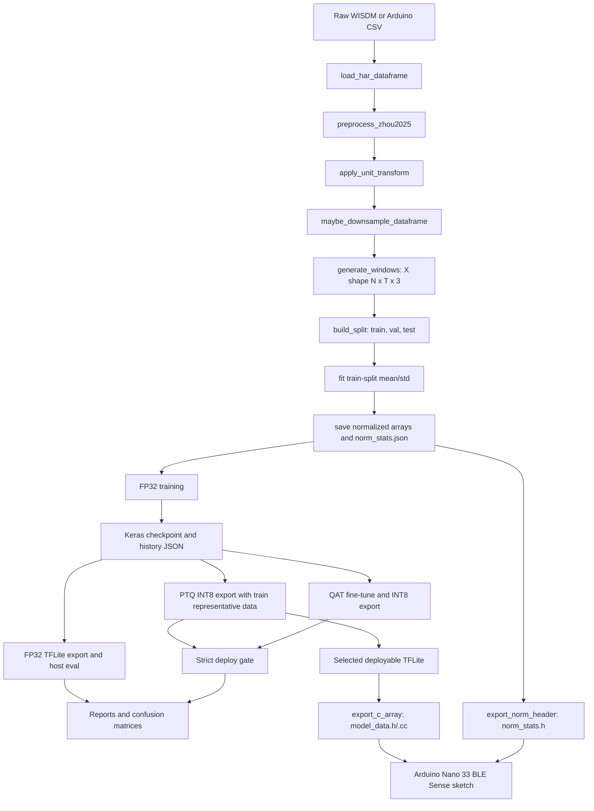
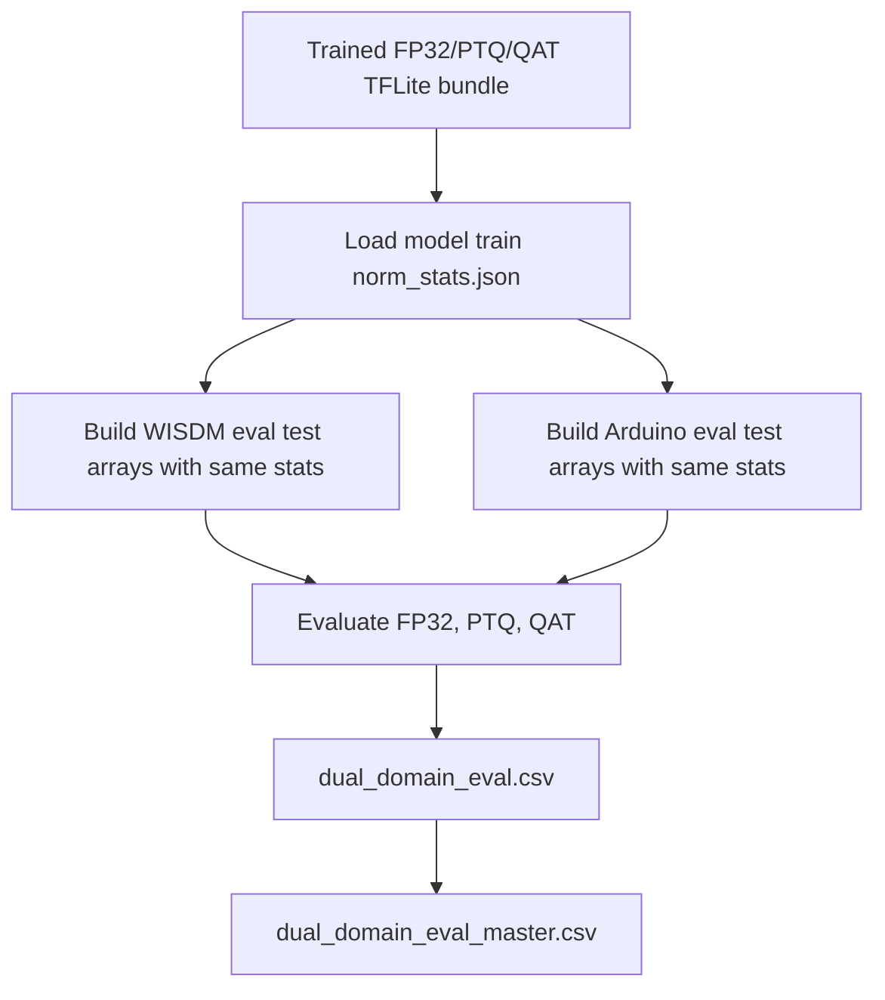
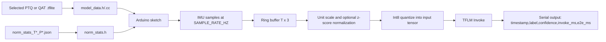

# M3 End-To-End HAR Pipeline

This document describes the code path used for the M3 accelerometer-only HAR experiments with DeepConvLSTM and Daghero, from raw CSV input through training, validation, TFLite evaluation, and Arduino deployment.

## Scope And Invariants

The M3 pipeline is accelerometer-only. The raw schema is:

```text
user,activity,timestamp,x-axis,y-axis,z-axis
```

The model input shape is always `[batch, T, 3]`, where `T` is `100` for the main 5-second 20 Hz runs and `50` for the 2.5-second window ablations. The output shape is `[batch, 6]`, with class order:

```text
Walking, Jogging, Upstairs, Downstairs, Sitting, Standing
```

The Arduino deployment path uses the same three accelerometer channels. We do not add gyroscope or magnetometer inputs, do not change model I/O shape, and do not add inference-time augmentation. Orientation robustness is trained in through optional train-only accelerometer rotation.

| Stage | Input | Output |
| --- | --- | --- |
| Raw load | WISDM-style CSV with `user,activity,timestamp,x-axis,y-axis,z-axis` | Pandas dataframe plus schema/sanity metadata |
| Windowing | Ordered accelerometer rows per user/activity | `X` windows shaped `[N,T,3]`, labels `y`, user ids |
| Splitting | Window arrays and labels | `X_train`, `X_val`, `X_test`, `y_train`, `y_val`, `y_test` |
| Normalization | Raw train/val/test windows | Normalized float32 arrays plus `norm_stats_T*_P*.json` |
| FP32 training | Normalized train windows and one-hot labels | Keras `.keras` checkpoint, history JSON |
| TFLite export | Keras checkpoint and representative train data | FP32 `.tflite`, PTQ INT8 `.tflite`, QAT INT8 `.tflite` |
| Evaluation | Keras checkpoint or TFLite plus normalized test windows | Accuracy, macro-F1, per-class metrics, confusion matrix, model size, dtype/ops/latency |
| Deployment | Selected INT8 `.tflite` plus `norm_stats.json` | `deploy/common/model_data.h`, `model_data.cc`, `norm_stats.h` |

## Pipeline Diagram



## M3 Entry Points

The Slurm wrappers call [src/m3/run_experiment.py](/shared/b00088568/github/har-mcu/src/m3/run_experiment.py), which validates config contracts and dispatches by transfer mode.

| Transfer mode | Code path | Training domain | Evaluation domain | Notes |
| --- | --- | --- | --- | --- |
| `source_only` | [src/run_paper_experiment.py](/shared/b00088568/github/har-mcu/src/run_paper_experiment.py) | WISDM | WISDM | Used by E00 anchor. |
| `zero_shot` | [src/m3/transfer.py](/shared/b00088568/github/har-mcu/src/m3/transfer.py) | WISDM | Arduino | Arduino eval arrays are normalized with source WISDM train stats. |
| `finetune` | [src/m3/transfer.py](/shared/b00088568/github/har-mcu/src/m3/transfer.py) | WISDM pretrain, Arduino fine-tune | Arduino | Final checkpoint and quantization use Arduino fine-tune train stats. |
| `arduino_from_scratch` | [src/run_paper_experiment.py](/shared/b00088568/github/har-mcu/src/run_paper_experiment.py) | Arduino | Arduino | Used by E10 and E12. |

The active M3 configs for the rotation experiments are E00, E03, E04, E05, E06, E07, E08, E09, E10, E11, and E12.

| Experiment | Mode | Source | Train | Eval | T | Target Hz | Normalization | Unit mode | Rotation |
| --- | --- | --- | --- | --- | ---: | ---: | --- | --- | --- |
| `E00_wisdm_m2_anchor` | `source_only` | `wisdm` | `wisdm` | `wisdm` | 100 | 20 | `train_zscore` | `raw_no_conversion` | enabled, p=0.5 |
| `E03_arduino_downsample_20hz_T100` | `zero_shot` | `wisdm_arduino` | `wisdm` | `arduino` | 100 | 20 | `train_zscore` | `raw_no_conversion` | enabled, p=0.5 |
| `E04_wisdm_to_g_arduino_g` | `zero_shot` | `wisdm_arduino` | `wisdm` | `arduino` | 100 | 20 | `train_zscore` | `wisdm_to_g` | enabled, p=0.5 |
| `E05_legacy_arduino_to_mps2` | `zero_shot` | `wisdm_arduino` | `wisdm` | `arduino` | 100 | 20 | `train_zscore` | `arduino_to_mps2_legacy` | enabled, p=0.5 |
| `E06_no_norm_matched` | `zero_shot` | `wisdm_arduino` | `wisdm` | `arduino` | 100 | 20 | `none` | `raw_no_conversion` | enabled, p=0.5 |
| `E07_skip_inference_norm_diag` | `zero_shot` | `wisdm_arduino` | `wisdm` | `arduino` | 100 | 20 | `train_zscore` | `raw_no_conversion` | enabled, p=0.5 |
| `E08_T50_window` | `zero_shot` | `wisdm_arduino` | `wisdm` | `arduino` | 50 | 20 | `train_zscore` | `raw_no_conversion` | enabled, p=0.5 |
| `E09_wisdm_pretrain_arduino_finetune` | `finetune` | `wisdm_arduino` | `arduino` | `arduino` | 100 | 20 | `train_zscore` | `raw_no_conversion` | enabled, p=0.5 |
| `E10_arduino_from_scratch` | `arduino_from_scratch` | `arduino` | `arduino` | `arduino` | 100 | 20 | `train_zscore` | `raw_no_conversion` | enabled, p=0.5 |
| `E11_wisdm_pretrain_arduino_finetune_T50` | `finetune` | `wisdm_arduino` | `arduino` | `arduino` | 50 | 20 | `train_zscore` | `raw_no_conversion` | enabled, p=0.5 |
| `E12_arduino_from_scratch_T50` | `arduino_from_scratch` | `arduino` | `arduino` | `arduino` | 50 | 20 | `train_zscore` | `raw_no_conversion` | enabled, p=0.5 |

E07 is diagnostic-only because it skips inference normalization. It must not be selected as a final deployment candidate.

## Dataset Construction

[src/data/build_dataset.py](/shared/b00088568/github/har-mcu/src/data/build_dataset.py) builds the processed arrays. It loads the configured domain CSV, applies preprocessing, applies an explicit unit transform, optionally downsamples by deterministic integer stride, creates windows, creates train/val/test splits, fits normalization only on the training split, and saves arrays plus metadata.

Important details:

- Preprocessing drops rows with null required fields, drops rows with timestamp `0`, then sorts by `user,timestamp`.
- Axis columns are always `x-axis`, `y-axis`, `z-axis`.
- Windows are generated per user so a window never crosses a user boundary.
- `label_policy: drop_cross_boundary` drops windows whose activity changes inside the window.
- `overlap: 0.5`, so the step is `T / 2`.
- `random_stratified` uses stratified `train_test_split`.
- `user_holdout` tooling exists, but these M3 runs use `random_stratified`.
- Normalization mode `train_zscore` fits per-axis mean/std on `X_train_raw` only, then applies those stats to train, val, and test.
- Normalization mode `none` writes zero mean and unit std and leaves arrays in raw units.

Saved dataset artifacts use this pattern:

```text
data/processed/m3/<experiment_id>/<suffix>/X_train_T<T>_P<protocol>.npy
data/processed/m3/<experiment_id>/<suffix>/X_val_T<T>_P<protocol>.npy
data/processed/m3/<experiment_id>/<suffix>/X_test_T<T>_P<protocol>.npy
data/processed/m3/<experiment_id>/<suffix>/norm_stats_T<T>_P<protocol>.json
data/processed/m3/<experiment_id>/<suffix>/datacard_T<T>_P<protocol>.json
```

For transfer experiments the suffix can include subdirectories such as `source_wisdm`, `eval_arduino`, `pretrain_wisdm`, or `finetune_arduino`.

## Train-Time Rotation Augmentation

[src/train/augment.py](/shared/b00088568/github/har-mcu/src/train/augment.py) implements one augmentation: random 3D rotation of accelerometer windows. It is applied only to training batches and never changes the saved dataset arrays, model input shape, inference preprocessing, PTQ representative dataset, or Arduino code.

The literature source for the idea is accelerometer orientation robustness in HAR. Yurtman and Barshan, "Activity Recognition Invariant to Sensor Orientation with Wearable Motion Sensors," Sensors 2017, DOI `10.3390/s17081838`, frames orientation changes as rotations of wearable motion-sensor vectors and motivates orientation-invariant HAR systems: https://doi.org/10.3390/s17081838. The direct data-augmentation precedent is Caramaschi, Papini, and Caiani, "Device Orientation Independent Human Activity Recognition Model for Patient Monitoring Based on Triaxial Acceleration," Applied Sciences 2023, DOI `10.3390/app13074175`, which applies rotation matrices to triaxial accelerometer signals so a HAR model can handle device displacement: https://doi.org/10.3390/app13074175. Our implementation uses a single uniformly sampled SO(3) rotation per training window rather than a fixed axis/angle grid.

```mermaid
flowchart LR
    A[Normalized train window X: T x 3] --> B[Denormalize: X_raw = X * std + mean]
    B --> C[Sample one uniform SO(3) matrix R per window]
    C --> D[Rotate all timesteps: X_raw_rot = X_raw * R]
    D --> E[Renormalize: X_rot = (X_raw_rot - mean) / std]
    E --> F[model.fit training batch]
```

Configuration keys:

```yaml
augment:
  accel_rotation:
    enabled: true
    probability: 0.5
    apply_in_qat: true
    mode: uniform_so3
```

Behavior:

- `enabled: false` fully disables augmentation.
- `probability` is per window.
- `mode: uniform_so3` samples a valid random 3D rotation matrix.
- One rotation matrix is shared across all timesteps in a window.
- The helper requires exactly three feature channels.
- Current `X_train` arrays are already z-score normalized, so rotation must not happen directly on those normalized values.
- For each selected training window, the helper loads the saved train-split `mean` and `std`, denormalizes with `X_raw = X_norm * std + mean`, rotates `X_raw`, then re-normalizes with the same train-split stats before yielding the batch.
- Validation arrays and test arrays are passed directly to `model.fit(..., validation_data=(X_val, y_val))` and evaluation. They are not augmented.
- PTQ representative arrays are read by the PTQ converter path and are not passed through the augmentation helper.
- QAT uses the same training-input helper when `apply_in_qat: true`, while its converter representative data stays untouched.
- The augmentation has zero inference-time cost because only the training input object changes.

All current M3 rotation configs enable this block with probability `0.5`. [configs/default.yaml](/shared/b00088568/github/har-mcu/configs/default.yaml) keeps it disabled by default.

Call sites:

- [src/train/train_baseline.py](/shared/b00088568/github/har-mcu/src/train/train_baseline.py)
- [src/train/train_model.py](/shared/b00088568/github/har-mcu/src/train/train_model.py)
- [src/m3/transfer.py](/shared/b00088568/github/har-mcu/src/m3/transfer.py)
- [src/quant/qat_train.py](/shared/b00088568/github/har-mcu/src/quant/qat_train.py)

## Model Architectures

Both deployed variants use Conv2D-safe implementations so TensorFlow Model Optimization Toolkit QAT can annotate supported layers reliably. The external Keras input remains `[batch, T, 3]`.

### DeepConvLSTM

Builder: `build_deepconv_lstm_conv2d` in [src/models/deepconv_lstm.py](/shared/b00088568/github/har-mcu/src/models/deepconv_lstm.py).

Compile function: `compile_deepconv_lstm`.

Optimizer and objective:

- Optimizer: `RMSprop`
- Learning rate: `train.learning_rate`, default `0.001`
- Loss: `categorical_crossentropy`
- Keras metric: `accuracy`

T100 summary:

| Layer | Output shape | Params |
| --- | --- | ---: |
| input | `(None, 100, 3)` | 0 |
| reshape_in | `(None, 100, 1, 3)` | 0 |
| conv1, Conv2D 32 filters `(3,1)`, ReLU | `(None, 98, 1, 32)` | 320 |
| dropout1 | `(None, 98, 1, 32)` | 0 |
| conv2, Conv2D 64 filters `(3,1)`, ReLU | `(None, 96, 1, 64)` | 6,208 |
| dropout2 | `(None, 96, 1, 64)` | 0 |
| reshape_squeeze | `(None, 96, 64)` | 0 |
| lstm, 100 units, return sequences | `(None, 96, 100)` | 66,000 |
| flatten | `(None, 9600)` | 0 |
| dropout3 | `(None, 9600)` | 0 |
| classifier, Dense 6 softmax | `(None, 6)` | 57,606 |
| Total | | 130,134 |

T50 differences:

| Layer | Output shape | Params |
| --- | --- | ---: |
| input | `(None, 50, 3)` | 0 |
| conv1 | `(None, 48, 1, 32)` | 320 |
| conv2 | `(None, 46, 1, 64)` | 6,208 |
| reshape_squeeze | `(None, 46, 64)` | 0 |
| lstm | `(None, 46, 100)` | 66,000 |
| flatten | `(None, 4600)` | 0 |
| classifier | `(None, 6)` | 27,606 |
| Total | | 100,134 |

### Daghero

Builder: `build_daghero_2layer_conv2d` in [src/models/daghero_cnn_searchspace_tf.py](/shared/b00088568/github/har-mcu/src/models/daghero_cnn_searchspace_tf.py).

Compile function: `compile_daghero_cnn`.

Optimizer and objective:

- Optimizer: `Adam`
- Learning rate: `train.learning_rate`, default `0.001`
- Loss: `categorical_crossentropy`
- Keras metric: `accuracy`

T100 summary:

| Layer | Output shape | Params |
| --- | --- | ---: |
| input | `(None, 100, 3)` | 0 |
| reshape_in | `(None, 100, 1, 3)` | 0 |
| conv1, Conv2D 32 filters `(7,1)`, no bias | `(None, 100, 1, 32)` | 672 |
| bn1 | `(None, 100, 1, 32)` | 128 |
| relu1 | `(None, 100, 1, 32)` | 0 |
| pool1, MaxPool2D `(2,1)` | `(None, 50, 1, 32)` | 0 |
| conv2, Conv2D 64 filters `(7,1)`, no bias | `(None, 50, 1, 64)` | 14,336 |
| bn2 | `(None, 50, 1, 64)` | 256 |
| relu2 | `(None, 50, 1, 64)` | 0 |
| pool2, MaxPool2D `(2,1)` | `(None, 25, 1, 64)` | 0 |
| gap, GlobalAveragePooling2D | `(None, 64)` | 0 |
| drop | `(None, 64)` | 0 |
| fc1, Dense 64 ReLU | `(None, 64)` | 4,160 |
| classifier, Dense 6 softmax | `(None, 6)` | 390 |
| Total | | 19,942 |

Trainable params are `19,750`; non-trainable batch-normalization params are `192`.

T50 keeps the same parameter count. The pooling path changes temporal shapes to `50 -> 25 -> 12`, then global average pooling returns `(None, 64)`.

## TFLite Model Sizes

These sizes are from the completed accelerometer-rotation exports under:

```text
models_tflite/m3/<experiment_id>/accel_rotation/<model_variant>/<experiment_code>/
```

| Model | Window | FP32 TFLite KB | PTQ INT8 KB | QAT INT8 KB |
| --- | ---: | ---: | ---: | ---: |
| `deepconv_lstm_conv2d` | 100 | 513.617 | 136.922 | 137.344 |
| `deepconv_lstm_conv2d` | 50 | 396.430 | 107.625 | 108.047 |
| `daghero_cnn_2layer_conv2d` | 100 | 80.406 | 26.133 | 26.734 |
| `daghero_cnn_2layer_conv2d` | 50 | 80.406 | 26.133 | 26.734 |

Representative T100 exports:

```text
models_tflite/m3/E00_wisdm_m2_anchor/accel_rotation/deepconv_lstm_conv2d/e00/deepconv_lstm_conv2d_T100_Prandom_stratified_E00_deepconv_lstm_r0_fp32.tflite
models_tflite/m3/E00_wisdm_m2_anchor/accel_rotation/deepconv_lstm_conv2d/e00/deepconv_lstm_conv2d_T100_Prandom_stratified_E00_deepconv_lstm_r0_ptq_int8.tflite
models_tflite/m3/E00_wisdm_m2_anchor/accel_rotation/deepconv_lstm_conv2d/e00/deepconv_lstm_conv2d_T100_Prandom_stratified_E00_deepconv_lstm_r0_qat.tflite
models_tflite/m3/E00_wisdm_m2_anchor/accel_rotation/daghero_cnn_2layer_conv2d/e00/daghero_cnn_2layer_conv2d_T100_Prandom_stratified_E00_daghero_cnn_2layer_conv2d_r0_fp32.tflite
models_tflite/m3/E00_wisdm_m2_anchor/accel_rotation/daghero_cnn_2layer_conv2d/e00/daghero_cnn_2layer_conv2d_T100_Prandom_stratified_E00_daghero_cnn_2layer_conv2d_r0_ptq_int8.tflite
models_tflite/m3/E00_wisdm_m2_anchor/accel_rotation/daghero_cnn_2layer_conv2d/e00/daghero_cnn_2layer_conv2d_T100_Prandom_stratified_E00_daghero_cnn_2layer_conv2d_r0_qat.tflite
```

## Training, Validation, And Callbacks

FP32 training uses [src/train/train_model.py](/shared/b00088568/github/har-mcu/src/train/train_model.py), or the equivalent fine-tune helper in [src/m3/transfer.py](/shared/b00088568/github/har-mcu/src/m3/transfer.py). Labels are converted to one-hot with `tf.keras.utils.to_categorical`.

Default training settings from [configs/default.yaml](/shared/b00088568/github/har-mcu/configs/default.yaml):

| Setting | Value |
| --- | --- |
| `seed` | `42` |
| `train.learning_rate` | `0.001` |
| `train.batch_size` | `64` |
| `train.epochs` | `50` |
| `train.dropout` | `0.3` for DeepConvLSTM builder; Daghero builder default is `0.2` unless passed through model kwargs |
| `train.reduce_lr_factor` | `0.5` |
| `train.reduce_lr_patience` | `5` |
| `train.early_stopping_patience` | `10` |

FP32 and fine-tune callbacks:

| Callback | Monitor | Behavior |
| --- | --- | --- |
| `ReduceLROnPlateau` | `val_loss` | Multiply LR by `0.5` after 5 plateau epochs. |
| `EarlyStopping` | `val_loss` | Stop after 10 plateau epochs and restore best weights. |

Validation data is passed as `(X_val, y_val_one_hot)` and is never augmented. Test data is not used by `model.fit`.

The FP32 and fine-tune paths save the model after the Keras fit call. If `EarlyStopping(..., restore_best_weights=True)` triggers, the saved Keras checkpoint contains the best validation-loss weights from that fit call. If training reaches the configured epoch limit without early stopping, the saved checkpoint is the final epoch weights.

QAT settings:

| Setting | Value |
| --- | --- |
| `quant.qat.enabled` | `true` |
| `quant.qat.annotation_policy` | `auto` |
| `quant.qat.learning_rate` | `0.0001` |
| `quant.qat.epochs` | `10` |
| `quant.qat.batch_size` | `64` |
| `quant.qat.representative_source` | `train` |
| `quant.qat.representative_samples` | `256` |
| `quant.qat.device_preference` | `gpu` with CPU fallback |

QAT compiles the quantized model with `RMSprop(learning_rate=quant.qat.learning_rate)`, `categorical_crossentropy`, and `accuracy`. The current QAT training loop does not attach early stopping or a learning-rate scheduler; it runs the configured QAT epoch count unless the runtime fails.

## Quantization And Deploy Gate

PTQ is implemented in [src/quant/ptq_full_int8.py](/shared/b00088568/github/har-mcu/src/quant/ptq_full_int8.py). It loads the final FP32 checkpoint, uses `tf.lite.Optimize.DEFAULT`, and calibrates from the configured train split representative data.

QAT is implemented in [src/quant/qat_train.py](/shared/b00088568/github/har-mcu/src/quant/qat_train.py). It loads the FP32 checkpoint, forces a single-batch TFLite-friendly input where possible, applies TF-MOT quantization, trains for the configured QAT epochs, and exports strict full-integer TFLite.

Strict quantization settings:

```yaml
quant:
  ptq:
    representative_source: train
    enforce_full_int8: true
    strict_full_int8: true
    require_tflm_compatible: true
    accepted_integer_io_dtypes: [int8, uint8]
  qat:
    representative_source: train
    enforce_full_int8: true
    strict_full_int8: true
    require_tflm_compatible: true
    accepted_integer_io_dtypes: [int8, uint8]
```

The deploy gate checks full-integer I/O, accepted input/output dtypes, TFLM op compatibility, and unsupported ops using [src/quant/deploy_gate.py](/shared/b00088568/github/har-mcu/src/quant/deploy_gate.py) and the reference op set in [src/deploy/tflm_reference_ops.py](/shared/b00088568/github/har-mcu/src/deploy/tflm_reference_ops.py).

## Evaluation Metrics

Keras checkpoint evaluation is implemented in [src/eval/evaluate_model.py](/shared/b00088568/github/har-mcu/src/eval/evaluate_model.py). TFLite evaluation is implemented in [src/eval/eval_tflite.py](/shared/b00088568/github/har-mcu/src/eval/eval_tflite.py).

Reported metrics and artifacts:

- accuracy
- macro-F1
- per-class precision, recall, F1, and support
- `classification_report`
- confusion matrix JSON
- confusion matrix PNG
- TFLite model size KB
- TFLite input dtype and output dtype
- TFLite interpreter ops and op count
- host-side TFLite latency mean, median, and p95 when timing is enabled
- deploy-gate status for PTQ and QAT

TFLite timing defaults:

```yaml
eval:
  tflite_timing:
    enabled: true
    warmup_samples: 32
    timed_samples: 256
```

The dual-domain eval runner disables timing to keep the comparison focused on correctness metrics and to avoid spending scheduler time on repeated latency sampling.

## Dual-Domain Off/On Comparison

[src/m3/dual_domain_eval.py](/shared/b00088568/github/har-mcu/src/m3/dual_domain_eval.py) evaluates already exported TFLite artifacts on both WISDM and Arduino test splits. It builds eval datasets with the model's saved training mean/std, so each model is scored at the input scale it expects.

For FP32 and fine-tune runs, the evaluated TFLite bundle comes from the saved checkpoint described above. PTQ is converted from that checkpoint. QAT is fine-tuned from that checkpoint and then evaluated as its own INT8 artifact.



Completed comparison outputs:

```text
reports/m3/dual_domain_eval/dual_domain_eval_master.csv
reports/m3/dual_domain_eval/dual_domain_eval_master.md
```

The completed master table has 264 rows: 44 `{experiment, model, augmentation off/on}` combinations times 2 eval domains times 3 tiers.

## Deployment

Deployment export uses:

- [src/deploy/export_c_array.py](/shared/b00088568/github/har-mcu/src/deploy/export_c_array.py) to generate `model_data.h` and `model_data.cc`.
- [src/deploy/export_norm_header.py](/shared/b00088568/github/har-mcu/src/deploy/export_norm_header.py) to generate `norm_stats.h`.
- [deploy/arduino_infer/arduino_infer.ino](/shared/b00088568/github/har-mcu/deploy/arduino_infer/arduino_infer.ino) for live Nano 33 BLE Sense inference.



The Arduino sketch keeps a ring buffer of `WINDOW_SIZE x 3`, samples accelerometer data at `SAMPLE_RATE_HZ`, normalizes with `kNormMean` and `kNormStd` when `APPLY_NORMALIZATION=1`, quantizes normalized values into the model input tensor, invokes TFLM, and prints predicted label plus timing.

No rotation augmentation runs on-device. Its cost is paid only during training.

## Output Locations

Common artifact patterns:

```text
checkpoints/m3/<experiment_id>/<suffix>/<model>_T<T>_P<protocol>_<run_id>.keras
checkpoints/m3/<experiment_id>/<suffix>/<model>_T<T>_P<protocol>_<run_id>_history.json
models_tflite/m3/<experiment_id>/<suffix>/<model>_T<T>_P<protocol>_<run_id>_fp32.tflite
models_tflite/m3/<experiment_id>/<suffix>/<model>_T<T>_P<protocol>_<run_id>_ptq_int8.tflite
models_tflite/m3/<experiment_id>/<suffix>/<model>_T<T>_P<protocol>_<run_id>_qat.tflite
reports/m3/<suffix>/<model_or_paper_reports>/
deploy/common/model_data.h
deploy/common/model_data.cc
deploy/common/norm_stats.h
```

The accelerometer-rotation artifacts are under:

```text
models_tflite/m3/<experiment_id>/accel_rotation/<model_variant>/<experiment_code>/
reports/m3/accel_rotation/<model_variant>/<experiment_code>/
```

The clean no-rotation ablation artifacts are under:

```text
models_tflite/m3/<experiment_id>/no_accel_rotation/<model_variant>/<experiment_code>/
reports/m3/no_accel_rotation/<model_variant>/<experiment_code>/
```

The dual-domain comparison artifacts are under:

```text
reports/m3/dual_domain_eval/<augment_label>/<model_variant>/<experiment_code>/
reports/m3/dual_domain_eval/dual_domain_eval_master.csv
reports/m3/dual_domain_eval/dual_domain_eval_master.md
```

## Slurm Commands

Run clean full-dataset DeepConvLSTM and Daghero M3 training for both augmentation conditions:

```bash
bash scripts/slurm/submit_m3_rotation_ablation_train.sh
```

Run dual-domain off/on TFLite evaluation after the clean training array succeeds. This evaluates 44 `{experiment, model, augment off/on}` rows as 11 Slurm array tasks, with each matrix row producing 2 domains x 3 tiers:

```bash
M3_SLURM_DEPENDENCY=afterok:<TRAIN_ARRAY_JOBID> \
M3_DUAL_EVAL_TASK_START=0 \
M3_DUAL_EVAL_TASK_LIMIT=44 \
M3_DUAL_EVAL_TASKS_PER_ARRAY_TASK=4 \
M3_DUAL_EVAL_ARRAY_CONCURRENCY=11 \
bash scripts/slurm/submit_m3_dual_domain_eval.sh
```

Aggregate dual-domain results:

```bash
/shared/b00088568/myenvs/tinymlproj/bin/python -m src.m3.dual_domain_eval --aggregate-only --output-dir reports/m3/dual_domain_eval
```
